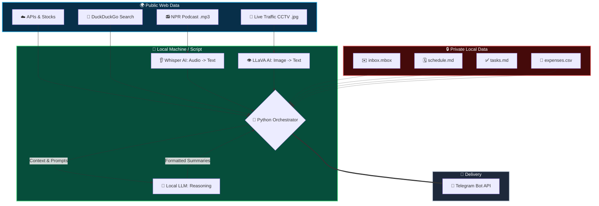

# 🤖 The Sovereign Agent | Zero-Cloud Personal AI Dashboard

[](https://www.python.org/)
[](https://ollama.com/)
[](https://opensource.org/licenses/MIT)

**The Sovereign Agent** is a privacy-first, multimodal AI assistant built entirely with Python and local open-source models. It acts as an elite executive assistant that reads your emails, checks your bank spending, cross-references your daily schedule with live weather, looks at local traffic cameras, listens to the morning news—and compiles it all into a single Telegram message before you wake up.

**The catch?** Your private data never leaves your computer. 

---

## ✨ Key Features

*   🔒 **100% Local Privacy:** Processes local `.mbox` (emails), `.csv` (finances), and `.md` (schedules) files strictly on-device. No data is sent to OpenAI, Google, or Anthropic.
*   🧠 **Contextual Reasoning:** The AI doesn't just retrieve data; it *reasons* about it. (e.g., It will warn you to move an outdoor lunch indoors if the live weather API reports rain).
*   👁️ **Vision AI (LLaVA / qwen3-vl:32b):** Fetches live public CCTV snapshots and translates visual traffic congestion into a text summary.
*   👂 **Audio AI (Whisper):** Downloads the latest daily news podcast (.mp3) and transcribes the spoken audio into text locally.
*   📱 **Secure Push Delivery:** Formats the final intelligence briefing into an elegant, mobile-friendly HTML message delivered via a private Telegram bot.

---

## 🏗️ System Architecture


---  

## 💡 Insight: The Era of the Local Personal Agent (Featuring Gemma)

For years, the narrative around Artificial Intelligence was that bigger is better. To get utility out of AI, we were expected to hand over our most intimate digital lives—our calendars, our bank statements, our private emails—to massive corporate cloud servers. 

**This project demonstrates a paradigm shift.** 

By utilizing local Large Language Models like **Gemma** via Ollama, we can build a *Sovereign Agent*. Gemma is highly optimized and remarkably intelligent, proving that you don't need a massive, cloud-bound model to act as a personal assistant. 

When you ask an AI to prioritize your to-do list based on today's weather, or summarize an email from your boss, the AI is performing **contextual reasoning, not knowledge retrieval.** Gemma excels at this. It acts as a local "reasoning engine" that safely processes sensitive text locally, extracts the signal from the noise, and destroys the context window immediately after generation. 

This architecture proves that elite-level AI automation and absolute data privacy are no longer mutually exclusive.

---  

## 🚀 Setup & Installation

### 1. Prerequisites
*   **Python 3.8+** installed.
*   **[Ollama](https://ollama.com/)** installed and running on your machine.
*   A **Telegram Account** to receive the messages.

### 2. Download Local AI Models
Open your terminal and pull the necessary models into Ollama:
```bash
ollama pull gemma4:31b   # Or whichever Gemma/Llama model your hardware supports
ollama pull llava        # Required for the CCTV traffic image analysis
```
### 3. Install Python Dependencies  
```bash
pip install requests openai-whisper python-dotenv  ddgs
```
### 4. Create your Local Data Files 
Create the following dummy files in the same directory as the script so the AI has private data to analyze: schedule.md (List your daily meetings)
* tasks.md (List your chores)
* expenses.csv (Headers: Date,Category,Amount,Description)
* inbox.mbox (A standard text-based mailbox file)

### 5. Telegram Bot Setup  
1. Message @BotFather on Telegram and send /newbot to get your TELEGRAM_TOKEN.
2. Message @userinfobot on Telegram to get your personal TELEGRAM_CHAT_ID.

### 6. Environment Configuration
Create a .env file in the root directory:

```env 
# --- REQUIRED TELEGRAM SETTINGS ---
TELEGRAM_TOKEN="your_bot_token_here"
TELEGRAM_CHAT_ID="your_chat_id_here"

# --- LOCAL PRIVATE DATA PATHS ---
MBOX_PATH="inbox.mbox"
SCHEDULE_PATH="schedule.md"
TASKS_PATH="tasks.md"
EXPENSES_PATH="expenses.csv"

# --- OLLAMA LOCAL MODELS ---
OLLAMA_VISION_MODEL="llava"
OLLAMA_SUMMARY_MODEL="gemma4:31b"

```
### Run it daily in the morning

```bash
0 8 * * * cd /path/to/your/script/folder && /usr/bin/python3 ai_agent.py >> ai_agent.log 2>&1
```


