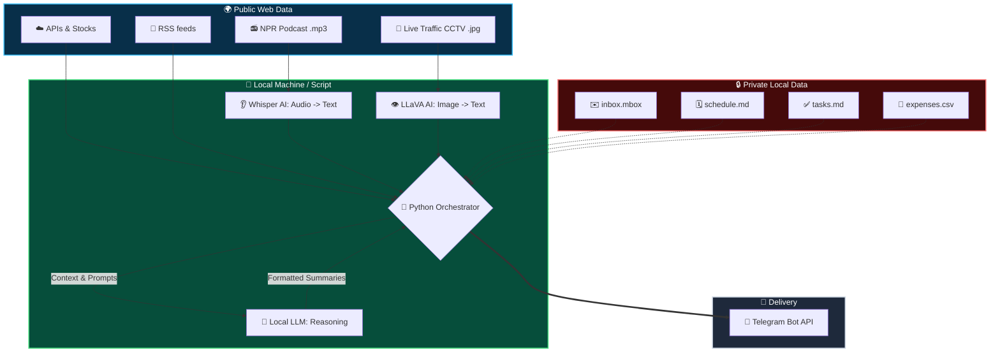
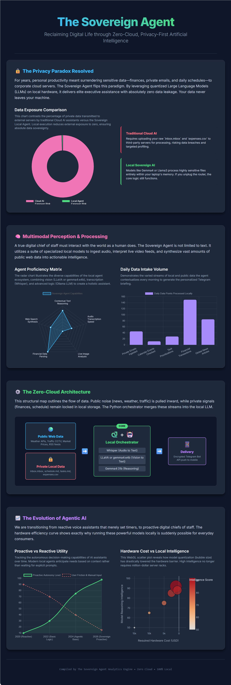

# 🤖 The Sovereign Agent : Your Zero-Cloud Private AI Assistant

[](https://www.python.org/)
[](https://ollama.com/)
[](https://opensource.org/licenses/MIT)

Welcome to **The Sovereign Agent**—a fully autonomous, locally-hosted AI executive assistant. 

In an era where every calendar event, financial transaction, and sensitive corporate email is routinely fed into third-party cloud APIs, this project asks a simple question: **What if your AI was completely yours?**

**The Sovereign Agent** is a privacy-first, multimodal AI assistant built entirely with Python and local open-source models. It acts as an elite executive assistant that reads your emails, checks your bank spending, cross-references your daily schedule with live weather, looks at local traffic cameras, listens to the morning news—and compiles it all into a single Telegram message before you wake up.

Powered by local LLMs (like **Gemma-4** via Ollama) and local speech recognition (OpenAI Whisper), this Python agent acts as a private reasoning engine. It digests your daily life, reads your emails, listens to the news, and pushes a highly condensed, actionable dashboard directly to your phone—with **zero risk of data leakage.**

**The catch?** Your private data never leaves your computer. 

# Table of content 
[✨ Key Features](#-key-features)  
[🏗️ System Architecture](#%EF%B8%8F-system-architecture)  
[💡 Insight: The Era of the Local Personal Agent (Featuring Gemma)](#-insight-the-era-of-the-local-personal-agent-featuring-gemma)  
[🚀 Setup & Installation](#-setup--installation)  
[🖼️Infographic of the Sovereign Agent Prediction Features & The Future of Private AI](#%EF%B8%8Finfographic-of-the-sovereign-agent-features--the-future-of-private-ai)


---

## ✨ Key Features

*   🔒 **100% Local Privacy (Zero-Cloud Processing):** Your `.mbox` emails, `.csv` expenses, and `.md` daily schedules are parsed and reasoned over *strictly* on your local machine. No API keys to OpenAI, Anthropic, or Google are required for the AI logic. No data is sent to OpenAI, Google, or Anthropic.
*   ai✨ **Contextual Reasoning:** The AI doesn't just retrieve data; it *reasons* about it. (e.g., It will warn you to move an outdoor lunch indoors if the live weather API reports rain).
*   🧠 **Intelligent Email Triage:** Instead of just summarizing, the agent uses **Gemma-4** to understand context. It can filter out marketing spam, recognize a casual lunch update, and instantly flag a critical message from your CEO or an expiring AWS certificate alert.
*   👀 **Vision-Powered Traffic Intel:** Integrates with local traffic CCTVs. It downloads the live camera feed and uses **LLaVA or gemma4:e4b** to physically "look" at the road and give you a one-sentence traffic report before you leave the house.
*   📰 **Unbiased Global Intel:** Bypasses search engine SEO spam by connecting directly to configurable, high-quality RSS feeds (TechCrunch, The Hacker News) 
*   👂 **Audio AI (Whisper):** Downloads the latest daily‑news podcast (MP3) and locally transcribes its spoken audio into text, generating a concise summary and sparing you from having to listen to the lengthy audio to stay updated.
*   📱 **Secure Push Delivery:** Formats the final intelligence briefing into an elegant, mobile-friendly HTML message delivered via a private Telegram bot.

### You can download the source code of the  [Sovereign Agent here](code/ai_agent.py)

---  
## Below is a sample output on TG 

<ul>  
📱 THE SOVEREIGN AGENT  
   
Your Zero-Cloud Daily Dashboard  

🌍 PUBLIC RADAR    
💹 NVDA: $189.31 (📈 +0.56)   
☁️ New York: 17.7°C | London: 7.0°C | Hong Kong: 27.6°C   
🚗 HK TM-CLK Tunnel TM-CLK Tunnel Southern Portal: Traffic flow is moderate, showing steady but uncongested movement across all visible lanes. [Cam](https://tdcctv.data.one.gov.hk/TC001F.JPG)   

👤 PRIVATE BRIEFING  
🗓️ Your day is moderately paced and ends with a doctor's visit, with the 17.7°C weather being perfect for your outdoor lunch.    
✅ Focus on fixing the CEO's roadmap slides and renewing the AWS certificates before midnight.   
💸 You have kept your recent spending to a modest $185.49.  
📧 Address the urgent CEO and Jira emails first, then update your network password.   

✉️ LATEST EMAILS:  
▪️ Jira Notifications: [Jira] Overdue Task: Renew AWS Certificates   
▪️ David (CEO): URGENT: Q2 Roadmap Slides Missing Data!  
▪️ IT Helpdesk: ACTION REQUIRED: Password expiring in 2 days   
▪️ Sarah Jenks: Running late for lunch!  
▪️ Tech Webinars: Master AI in 3 Days! Free Webinar   

📰 GLOBAL INTEL  
📻 GLOBAL AUDIO FLASH  
Source: [NPR News Now](https://prfx.byspotify.com/e/play.podtrac.com/npr-500005/npr.simplecastaudio.com/368f8510-314e-46f1-8d26-5b87ed6ab6eb/episodes/efdd9216-398f-43f2-b4de-63fefbd6e08c/audio/128/default.mp3?awCollectionId=368f8510-314e-46f1-8d26-5b87ed6ab6eb&awEpisodeId=efdd9216-398f-43f2-b4de-63fefbd6e08c&feed=O9WlY7a5&t=podcast&e=nx-s1-20260414-0200-long&p=500005&d=280&size=4480567)   
• The US military is blockading Iranian ports to pressure Tehran into a peace deal after talks in Islamabad collapsed.   
• US gas prices have surged 21% following attacks on Iran, prompting drivers to seek cheaper fuel at Native American reservation stations.   
• Canadian Prime Minister Mark Carney's Liberal Party has achieved a majority government after winning several key special elections.   

🤖 AI BREAKTHROUGHS  
• OpenAI has acquired the personal finance startup Hiro to integrate financial planning capabilities into ChatGPT.  [Read](https://techcrunch.com/2026/04/13/openai-has-bought-ai-personal-finance-startup-hiro/)   
• Microsoft is developing a new enterprise-grade AI agent designed with stricter security controls than the OpenClaw agent.  [Read](https://techcrunch.com/2026/04/13/microsoft-is-working-on-yet-another-openclaw-like-agent/)  
• Kepler Communications has deployed the largest orbital compute cluster consisting of 40 GPUs in Earth orbit.  [Read](https://techcrunch.com/2026/04/13/the-largest-orbital-compute-cluster-is-open-for-business/)  

🛡️ CYBERSECURITY  
• A critical remote code execution flaw in ShowDoc is currently being actively exploited on unpatched servers.  [Read](https://thehackernews.com/2026/04/showdoc-rce-flaw-cve-2025-0520-actively.html)  
• CISA has added six newly discovered exploited vulnerabilities in Fortinet, Microsoft, and Adobe software to its known exploited list.  [Read](https://thehackernews.com/2026/04/cisa-adds-6-known-exploited-flaws-in.html)  
• The FBI and Indonesian Police have dismantled the W3LL phishing network responsible for $20 million in attempted fraud.  [Read](https://thehackernews.com/2026/04/fbi-and-indonesian-police-dismantle.html)  


</ul>

---   

## 🏗️ System Architecture

The Sovereign Agent is built on a simple, modular, and highly robust pipeline:

1.  **Data Ingestion Layer**
    *   **Public Data:** Fetches stock prices (Yahoo Finance), Weather (Open-Meteo APIs), and live CCTV images.
    *   **Private Data:** Reads local system files (`tasks.md`, `schedule.md`, `expenses.csv`, and local mailboxes).
    *   **News Feeds:** Parses XML RSS feeds and downloads daily podcast `.mp3` files.
2.  **Local AI Processing Engine**
    *   **Whisper (Base):** Transcribes the downloaded audio news into raw text.
    *   **Ollama (LLaVA):** Ingests the base64-encoded CCTV image and outputs a textual traffic condition.
    *   **Ollama (Gemma-4:31b):** The "Brain" of the operation. It is fed the raw data context and uses its massive parameter count to reason, filter, and summarize the data into human-readable insights.
3.  **Delivery Layer**
    *   Formats the LLM outputs into an aesthetic, responsive message and securely pushes it to the Telegram Bot API.


---  
## 🛡️ Why Local LLMs? (The Data Leakage Problem)

We are currently sending our most valuable, sensitive data to third-party cloud providers just to get a summary of our day. 

*   *Want an AI to sort your emails?* You are handing over corporate secrets and password reset links.
*   *Want an AI to budget for you?* You are uploading your bank statements to the cloud.

**Gemma-4 changes the game.** By utilizing highly capable, open-weight models running locally via Ollama, we have crossed the threshold where we no longer need the cloud for elite-level reasoning. Gemma-4 is smart enough to understand that *"David needs the Q2 slides by EOD"* is an urgent priority, while *"Master AI in 3 Days Webinar"* is spam. 

The Sovereign Agent brings the power of an elite executive assistant directly to your silicon, ensuring that your data is heavily guarded and never leaves your home network.

---  

## 💡 Insight: The Era of the Local Personal Agent (Featuring Gemma)

For years, the narrative around Artificial Intelligence was that bigger is better. To get utility out of AI, we were expected to hand over our most intimate digital lives—our calendars, our bank statements, our private emails—to massive corporate cloud servers. 

**This project demonstrates a paradigm shift.** 

By utilizing local Large Language Models like **Gemma** via Ollama, we can build a *Sovereign Agent*. Gemma is highly optimized and remarkably intelligent, proving that you don't need a massive, cloud-bound model to act as a personal assistant. 

When you ask an AI to prioritize your to-do list based on today's weather, or summarize an email from your boss, the AI is performing **contextual reasoning, not knowledge retrieval.** Gemma excels at this. It acts as a local "reasoning engine" that safely processes sensitive text locally, extracts the signal from the noise, and destroys the context window immediately after generation. 

This architecture proves that elite-level AI automation and absolute data privacy are no longer mutually exclusive.

---  
## 🛠️ Tech Stack

*   **Python 3.10+** (Core logic and orchestration)
*   **Ollama** (Local LLM serving for Gemma-4 and LLaVA)
*   **OpenAI Whisper** (Local offline audio transcription)
*   **Telegram API** (Mobile push notifications)
*   **Standard Python Libs:** `mailbox`, `xml.etree`, `csv` (No bloated frameworks)


---  

## 🚀 Setup & Installation

### 1. Prerequisites
*   **Python 3.8+** installed.
*   **[Ollama](https://ollama.com/)** installed and running on your machine.
*   A **Telegram Account** to receive the messages.

### 2. Download Local AI Models
Open your terminal and pull the necessary models into Ollama:
```bash
ollama pull gemma4:31b   # Or whichever Gemma/Llama model your hardware supports
ollama pull llava        # Required for the CCTV traffic image analysis
```
### 3. Install Python Dependencies  
```bash
pip install requests openai-whisper python-dotenv  ddgs
```
### 4. Create your Local Data Files 
Create the following dummy files in the same directory as the script so the AI has private data to analyze: schedule.md (List your daily meetings)
* [tasks.md](code/tasks.md) (List your chores)
* [expenses.csv](code/expenses.csv) (Headers: Date,Category,Amount,Description)
* [inbox.mbox](code/inbox.mbox) (A standard text-based mailbox file)
* [schedule.md](code/schedule.md) (Your schedule)

### 5. 📱 Telegram Bot Setup  
It takes less than 3 minutes to complete and requires no coding.

1. Message @BotFather on Telegram and send /newbot to get your TELEGRAM_TOKEN.
2. Message @userinfobot on Telegram to get your personal TELEGRAM_CHAT_ID.

**Phase 1: Create the Bot & Get the Token**
1. Open the Telegram app and search for **@BotFather** (look for the official blue verification checkmark).
2. Click **Start** and send the command: `/newbot`
3. Give your bot a display name (e.g., *My Sovereign Agent*).
4. Give your bot a unique username that ends in "bot" (e.g., *jason_agent_bot*).
5. BotFather will reply with a long string of characters. **Copy this HTTP API Token**. 
   *(⚠️ Keep this secret! This is your `TELEGRAM_TOKEN`)*

**Phase 2: Activate the Bot**
1. Search for your newly created bot’s username in Telegram.
2. Click **Start** (or send it a quick "Hello" message). 
   *(Note: Bots cannot initiate conversations. You must message it first so it has permission to message you later).*

**Phase 3: Get Your Chat ID**
To tell the Python script *where* to send the message, you need your personal Telegram ID.
1. In Telegram, search for the bot: **@userinfobot** (or @GetIDs Bot).
2. Click **Start**.
3. It will immediately reply with your personal ID number (a string of numbers like `123456789`). **Copy this ID**. 
   *(This is your `TELEGRAM_CHAT_ID`)*


#### 💻 Add it to your `.env` File
Now, open the `.env` file in the same folder as your Python script and paste those two values at the very top:

```env
# --- REQUIRED TELEGRAM SETTINGS ---
TELEGRAM_TOKEN="1234567890:ABCdefGhIJKlmNoPQRstuVWXyz"
TELEGRAM_CHAT_ID="123456789"
```

### 6. Environment Configuration
Create a [.env](.env_sample) file in the directory:

```env 
# --- REQUIRED TELEGRAM SETTINGS ---
TELEGRAM_TOKEN=[Your_TG_TOKEN]
TELEGRAM_CHAT_ID=[Your_CHAT_ID]

# --- LOCAL MAILBOX PATH ---
# Provide the absolute or relative path to your .mbox file
MBOX_PATH="inbox.mbox"

# --- LOCAL PRIVATE DATA PATHS ---
SCHEDULE_PATH="schedule.md"
TASKS_PATH="tasks.md"
EXPENSES_PATH="expenses.csv"


# --- CCTV TRAFFIC SETTINGS ---
CCTV_IMAGE_URL=https://tdcctv.data.one.gov.hk/TC001F.JPG
CCTV_NAME="HK TM-CLK Tunnel TM-CLK Tunnel Southern Portal"


# The vision model used to analyze the CCTV image (e.g., llava, bakllava, qwen3-vl:32b,gemma4:e4b)
OLLAMA_VISION_MODEL=gemma4:e4b

# The text model used to summarize the news articles (e.g. gpt-oss:120b, llama3, mistral, gemma4:31b, qwen3-coder-next:q8_0 )
OLLAMA_SUMMARY_MODEL=gemma4:31b


# ==========================================
# 🤖 AI NEWS FEED ALTERNATIVES
# ==========================================

# TechCrunch AI (Default)
AI_FEED_URL="https://techcrunch.com/category/artificial-intelligence/feed/"

# VentureBeat AI (Excellent for enterprise AI & LLM news)
# AI_FEED_URL="https://venturebeat.com/category/ai/feed/"

# Wired - Artificial Intelligence (More mainstream/cultural impact)
# AI_FEED_URL="https://www.wired.com/feed/category/artificial-intelligence/latest/rss"

# The Verge - AI (Good mix of consumer tech and AI)
# AI_FEED_URL="https://www.theverge.com/rss/artificial-intelligence/index.xml"


# ==========================================
# 🛡️ CYBERSECURITY NEWS FEED ALTERNATIVES
# ==========================================

# The Hacker News (Default)
CYBER_FEED_URL="https://feeds.feedburner.com/TheHackersNews"

# BleepingComputer (Great for malware, ransomware, and practical IT alerts)
# CYBER_FEED_URL="https://www.bleepingcomputer.com/feed/"

# Krebs on Security (In-depth investigative cybersecurity journalism)
# CYBER_FEED_URL="https://krebsonsecurity.com/feed/"

# Dark Reading (Enterprise cybersecurity news)
# CYBER_FEED_URL="https://www.darkreading.com/rss.xml"
#

```
### 7. Run it each morning so that your personal intel dashboard is sent to your mobile device via Telegram before you wake up.

```bash
0 8 * * * cd /path/to/your/script/folder && /usr/bin/python3 ai_agent.py >> ai_agent.log 2>&1
```
--- 
## 🖼️Infographic of the Sovereign Agent Features & The Future of Private AI 

<div style="height: 200px; overflow-y: scroll;">
  <br>
 
</div>


