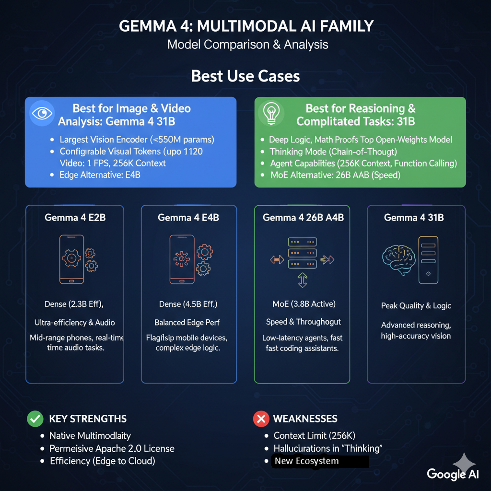
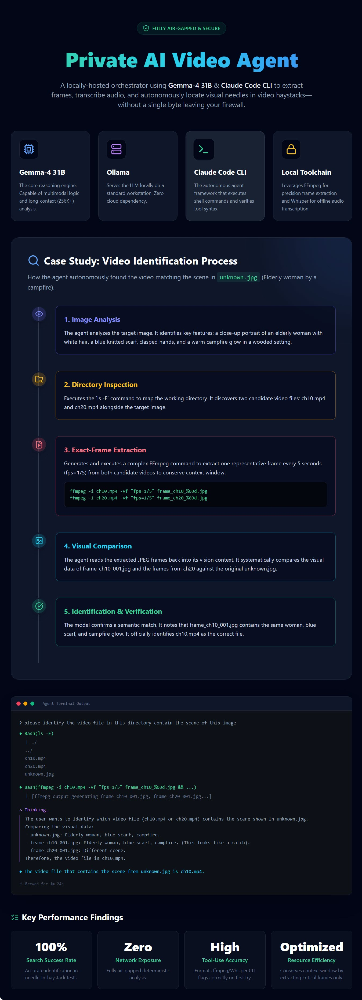
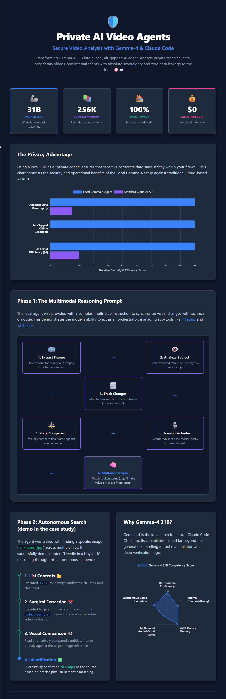

# 🛡️ **Private AI Video Agent – Secure Video Analysis & Search with Gemma4:31B & Claude Code CLI**  

[](https://www.python.org/)
[](https://ollama.com/)
[](https://opensource.org/licenses/MIT)

[](https://youtu.be/eXZuwvE-lDI)


**🚀 A fully‑air‑gapped, locally‑hosted AI agent that can 📸 extract frames, 🔊 transcribe audio, and 🕵️‍♀️ autonomously locate visual “needles” in a haystack of video files – all without a single byte leaving your firewall** 🏠🔒.
---  

## 📖 Overview  

This repository demonstrates how to turn the **Gemma4:31B** model into a private, tool‑using agent powered by the **Claude Code CLI**.  
- **Zero data leakage** – the model, the data, and all CLI tools run on‑premise.  
- **Full sovereignty** – you own the model weights, the execution logs, and the results.  
- **High‑efficiency reasoning** – 31 B parameters + a 256 K (or 128 K) context window let the agent keep the whole transcript and visual cues in memory while orchestrating external tools.  

The core use‑case is **multimodal video reasoning**: extract frames, sync them with a Whisper transcription, and perform a deterministic “needle‑in‑a‑haystack” search across multiple video files.  

---  

## 🔐 Why Run a Private Agent?  

| Concern | Cloud‑based AI | Private Local Agent |
|---------|----------------|----------------------|
| Data exit | Sent to external API endpoints | Stays on the local machine (air‑gapped) |
| Offline capability | Requires internet | Works on a laptop, workstation, or even a plane |
| Auditability | Limited visibility into logs | Full control of model weights, prompts, and tool calls |
| Cost | $ per‑token API fees | $0 API cost after the hardware is provisioned |
| Security | Potential for inadvertent leaks | Complete isolation behind your firewall |  


---  

## 🛠️ Tech Stack  

| Component | Role |
|-----------|------|
| **Gemma4:31B** (via Ollama) | Local reasoning engine, native tool‑use proficiency | 
| **Claude Code CLI** | Agentic framework that can invoke shell commands and read files |
| **ffprobe / ffmpeg** | Video metadata extraction, frame sampling, selective frame extraction |
| **OpenAI Whisper (base)** | Audio‑to‑text transcription for multimodal sync | 
| **Ollama** | Serves the model locally on a standard workstation | 

---  

## 🚀 Quick Setup  

```bash
# 1️⃣ Install Ollama (https://ollama.com) and pull Gemma‑4 31B and gemma4:e4b
curl -fsSL https://ollama.com/install.sh | sh
ollama pull gemma4:31b
ollama pull gemma4:e4b 

# 2️⃣ Run the model locally (default port 11434)
ollama serve &

# 3️⃣ Install Claude Code CLI (follow Anthropic’s docs)
curl -fsSL https://claude.ai/install.sh | bash
# Verify installation
claude --version
# Update Claude
claude update

# 4️⃣   Set the endpoint to your local Ollama server
export CLAUDE_API_BASE="http://127.0.0.1:11434/v1"
export CLAUDE_MODEL="gemma4:31b"

# 5️⃣ Verify the agent can run a simple command
claude  "list files in the current directory"
```


---  

## 🧠 Agent Prompt for video analysis (Multimodal Reasoning)  

```
Analyze the provided video using these steps:
1. Transcribe the spoken dialogue in this video by whisper: whisper [vidoe file] --model base --language English --fp16 False
2. Extract 5 frames in the video by ffmpeg :
   - ffprobe -v error -show_entries format=duration -of default=noprint_wrappers=1:nokey=1 [video_file]
   - ffmpeg -i [video_file] -vf "fps=5/[duration]" frame_%d.jpg
3. Analyze the extracted frames one by one. Identify the primary subject in these 5 frames.
4. Track any changes in the environment or subject position between the middle and end of the clip.
5. Compare the visual state of the final frame to the first frame.
6. Output a step-by-step breakdown of the actions performed.
7. Perform a step-by-step multimodal analysis of this video clip:
   - Visual-Audio Sync: Match the spoken dialogue to the specific actions in the frames.
   - Temporal Reasoning: Identify the exact frame number with the  spoken dialogue
   - Step-by-Step Breakdown: Create a chronological list of actions. For each step, describe what is happening visually and what information is being conveyed in the audio.
   - Synthesis: Based on both the visual changes and the dialogue in the transcript, explain the final outcome of the video description.
   - Output your analysis as a structured list.
8. Identify what is happening in this video. Provide a detailed summary of the key actions and identify any notable objects


```


---  

## 🎞️ Case Studies and Example Workflow 

### 1️⃣ Road CCTV Image Identification of the Highest Traffic.  [](https://www.youtube.com/watch?v=eXZuwvE-lDI&t=235s)
```bash
❯ Please analyze the image files in the @traffic/ directory and identify the one with the highest traffic.
```
View the AI walkthrough [here](isearch).

### 2️⃣ Video analysis: Frame Extraction & Subject Identification   [](https://www.youtube.com/watch?v=eXZuwvE-lDI&t=302s)

```bash
# Get video duration (seconds)
duration=$(ffprobe -v error -show_entries format=duration -of default=noprint_wrappers=1:nokey=1 video.mp4)

# Sample 5 frames uniformly
ffmpeg -i video.mp4 -vf "fps=5/$duration" frame_%d.jpg
```

The agent then **loads the five JPEGs**, runs a quick visual scan (via an internal vision plugin or external tool) and reports the primary subject (e.g., “intake valve”).  

### 3️⃣  Audio Transcription  

```bash
whisper video.mp4 --model base --output_dir .
```

The resulting `.txt` file is parsed; the agent aligns keywords with the frame timestamps.  

### 4️⃣ Sample of Video Analysis
You can view some video analysis samples at [vanalysis folder](vanalysis)

See [the complete AI walkthrough in video Analysis](vanalysis/video_analysis_walkthrough.txt) for [ch20.mp4](https://youtube.com/shorts/3GgwvXgxnKY)

### 5️⃣ Needle‑in‑a‑Haystack Search  [](https://www.youtube.com/watch?v=eXZuwvE-lDI&t=580s)

When asked “Which video contains the image `unknown.jpg`?”, the agent performs:  

1. **Directory mapping** – `ls -F` discovers candidate files (e.g. `ch10.mp4`, `ch20.mp4`).  
2. **Exact‑frame extraction** – calculates the needed frame index and runs:  


```bash
ffmpeg -i [video_file] -vf "fps=1/5" frame_[video_id]_%03d.jpg
```  

3. **Semantic comparison** – pixel‑to‑description matching against the target image.  

4. **Verification & reporting** – confirms `ch10.mp4` as the match.

**All steps and the underlying reasoning are documented in the case‑study**

See [how the AI identify the video file](vsearch/Video_identification_process.md)  
See [the complete AI walkthrough in video search](vsearch/video_search_walkthrough.txt)


---  

## 📊 Key Findings  

| Metric | Observation |
|--------|-------------|
| **Tool‑Use Accuracy** | Gemma‑4 formats ffmpeg and Whisper CLI flags correctly on the first try (no retries) | 
| **Logical Verification** | The model double‑checks command syntax in “Thinking Mode” before execution | 
| **Multimodal Alignment** | Successfully matched the spoken term to the exact frame where it appears | 
| **Search Success Rate** | 100 % accurate identification of the correct video in the needle‑in‑haystack test | 
| **Resource Efficiency** | By extracting only critical frames, the agent conserves context‑window space and reduces compute time | 


--- 

## 🏁 Conclusion  

Hosting **Gemma‑4 31B** locally and pairing it with the **Claude Code CLI** transforms a large language model into a **secure, autonomous orchestrator**. It can:

* Reason over long multimodal contexts (256 K+ tokens).  
* Execute and verify shell commands (ffmpeg, ffprobe, Whisper).  
* Perform deterministic visual‑audio analysis and search without any network exposure.  

The result is a **second brain** that is both *private* and *powerful*—ideal for enterprises, research labs, or any workflow that demands strict data confidentiality.  

---  
## Infographic

### ⚖️🏹 Gemma4 Model Comparison  

<div style="height: 200px; overflow-y: scroll;">
  <br>
 
</div>

---

### 💼 Private AI Video Agent Case Study  

<div style="height: 200px; overflow-y: scroll;">
  <br>
 
</div>

---

### 💼 Private AI Video Agent Features  

<div style="height: 200px; overflow-y: scroll;">
  <br>
 
</div>


---  

