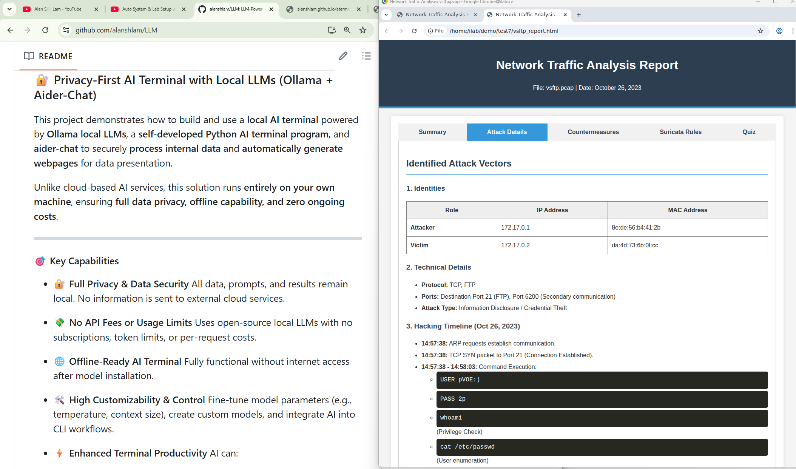
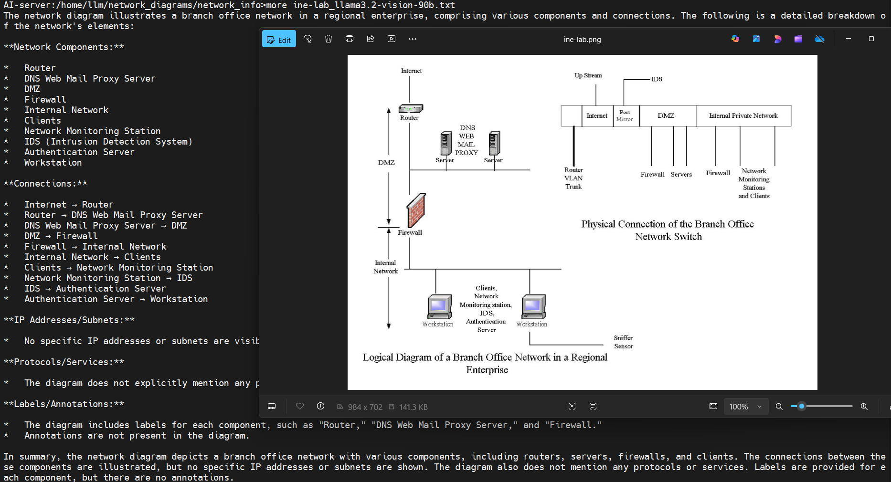
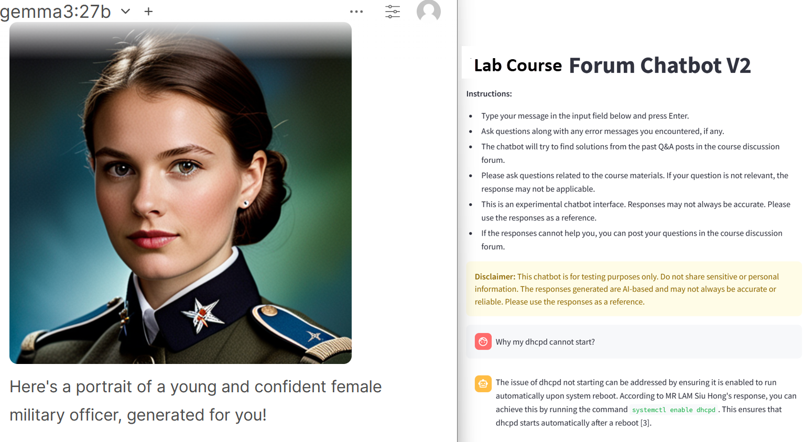
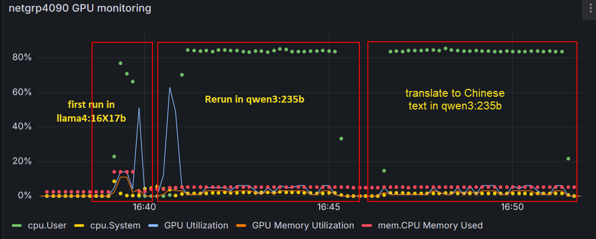
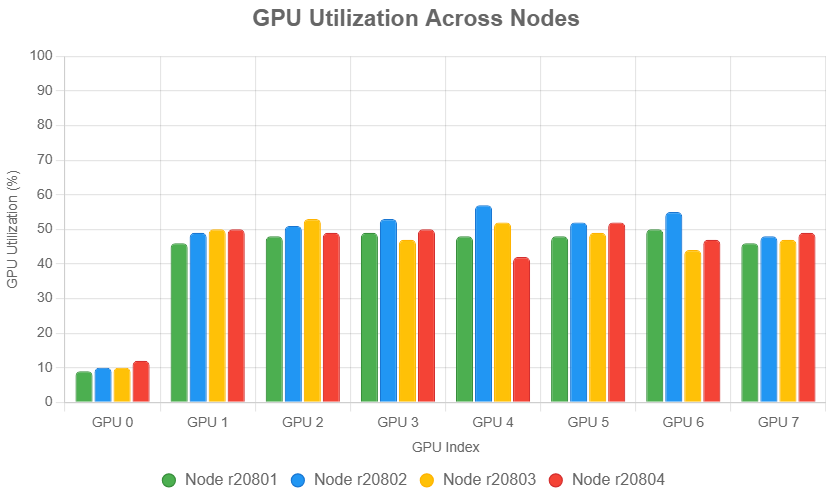
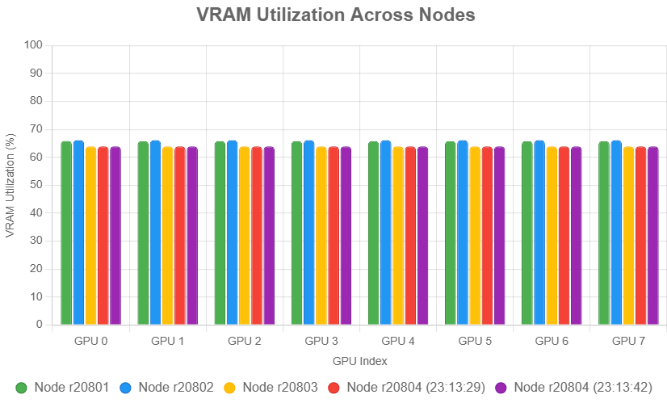

# LLM-Powered Knowledge Base for Enhanced Employee Job Handover, Backup, Training, and Research Project Archiving

## Project Overview
The objective of this project is to develop an advanced, AI-driven knowledge base leveraging a Large Language Model (LLM) that utilizes a vast repository of internal documents. This system aims to streamline employee job handovers, ensure effective job backups, enhance employee training, and archive research results from the [HoneyNet](https://github.com/alanshlam/HoneyNet) and [Pentest](https://github.com/alanshlam/Pentest) projects. Some AI image generation projects are also avialable at [gen_image](https://github.com/alanshlam/LLM/tree/main/gen_image)

## Key Areas of Impact
### The developed LLM knowledge bases can help the following areas in an organization. 

### Employee Job Handover
- **Knowledge Transfer Efficiency**: The LLM knowledge base will facilitate seamless knowledge transfer during job handovers by providing detailed documentation and real-time answers to queries.
- **Consistency**: Ensure that critical information is consistently communicated during handovers, reducing the risk of errors and knowledge gaps.

### Job Backup
- **Operational Continuity**: Enable backup employees to quickly understand and take over responsibilities by accessing comprehensive information on tasks and projects through the LLM.
- **Task Guidance**: Provide step-by-step guidance and automate routine tasks to ensure smooth operation in the absence of primary employees.

### Employee Training
- **Customized Learning Paths**: Offer personalized training content and resources tailored to individual employee needs, enhancing learning effectiveness.
- **Resource Availability**: Aggregate and organize training materials, making it easy for employees to access and study relevant content.
- **Interactive Support**: Provide instant support and answers to training-related queries, fostering a continuous learning environment.

### Research Results Archiving
- **Knowledge Preservation**: Archive research results from the [HoneyNet](https://github.com/alanshlam/HoneyNet) and [Pentest](https://github.com/alanshlam/Pentest) projects to ensure valuable insights and findings are preserved and accessible for future reference.
- **Enhanced Research Capabilities**: Facilitate easy retrieval and analysis of past research, aiding in the development of new projects and the continuous improvement of cybersecurity measures.
- **Compliance and Accountability**: Ensure that research documentation meets compliance standards and provides a clear record of the organization's cybersecurity efforts and advancements.

## Expected Benefits
- **Improved Efficiency**: Reduce the time and effort required for job handovers and backups, leading to increased productivity, especially for an organization with high staffing turnover.
- **Enhanced Knowledge Retention**: Preserve institutional knowledge and ensure it is easily accessible to all employees.
- **Better Training Outcomes**: Equip employees with the knowledge and skills they need through personalized and interactive training methods.
- **Cost Savings**: Minimize the costs associated with training and onboarding new employees through streamlined processes and automated support.
- **Research Continuity**: Maintain a comprehensive archive of HoneyNet and Pentest research, supporting ongoing innovation and improved security measures.

## Project Scope
1. **Data Collection and Integration**
   - Gather and digitize all relevant internal documents, including project reports, standard operating procedures (SOPs), training manuals, and communication logs.
   - Integrate these documents into a centralized repository accessible by the LLM.
   - Archive research results from cybersecurity projects, ensuring they are well-documented and easily retrievable.

2. **LLM Training and Customization**
   - Train the LLM on the collected internal documents to ensure it understands the specific context, terminology, and processes of the organization.
   - Customize the LLM to address specific use cases such as job handovers, job backups, employee training, and cybersecurity research archiving.

3. **System Development**
   - Develop an intuitive user interface for employees to interact with the LLM.
   - Implement features for document search, task automation, interactive FAQs, and research result archiving.

4. **Testing and Validation**
   - Conduct rigorous testing to ensure the accuracy and reliability of the LLM's responses.
   - Validate the system through pilot programs involving key departments and refine based on feedback.

5. **Deployment and Training**
   - Roll out the LLM-powered knowledge base across the organization.
   - Provide training sessions to ensure employees are comfortable using the new system.

## Studies


### 🔐 Privacy-First AI Terminal with Local LLMs (Ollama + Aider-Chat)

This project demonstrates how to build and use a **local AI terminal** powered by **Ollama local LLMs**, a **self-developed Python AI terminal program**, and **aider-chat** to securely **process internal data** and **automatically generate webpages** for data presentation.

Unlike cloud-based AI services, this solution runs **entirely on your own machine**, ensuring **full data privacy, offline capability, and zero ongoing costs**.


#### 🎯 Key Capabilities

* 🔐 **Full Privacy & Data Security**
  All data, prompts, and results remain local. No information is sent to external cloud services.

* 💸 **No API Fees or Usage Limits**
  Uses open-source local LLMs with no subscriptions, token limits, or per-request costs.

* 🌐 **Offline-Ready AI Terminal**
  Fully functional without internet access after model installation.

* 🛠 **High Customizability & Control**
  Fine-tune model parameters (e.g., temperature, context size), create custom models, and integrate AI into CLI workflows.

* ⚡ **Enhanced Terminal Productivity**
  AI can:

  * Explain commands
  * Process internal datasets
  * Generate scripts and configuration files
  * Build webpages from processed data
  * Assist with debugging and workflow automation


#### 🧩 Why Local LLM AI Terminal?

This project is ideal for:

* **System Administrators** working in secure or restricted environments
* **Developers** handling proprietary or sensitive data
* **Educators** building offline or private lab environments
* **Researchers** requiring reproducible, auditable AI workflows

If privacy, control, and local execution matter more than cloud convenience, this AI terminal approach is the right choice.


#### 🧰 Architecture Overview

* **Self-Developed Python AI Terminal**
  Orchestrates local AI workflows, file processing, and web generation. You can download the AI Terminal Python program [here](https://github.com/alanshlam/LLM/blob/main/code/super_agent.py)

* **Ollama**
  Runs large language models locally with full control over execution.

* **Aider-Chat / Open-Interpreter**
  Enables AI-assisted reasoning, scripting, and workflow automation directly in the terminal.

#### 📜 Sample files

* **[Prompt for analysing Malware Traffic](https://alanshlam.github.io/aterm/p/pcap_prompt.txt)**  
   Prompt for instructing LLM to analyse Malware Traffic and generate analysis report. 

* **[Sample of Malware Traffic Analysis Report Generated by LLM](https://alanshlam.github.io/aterm/p/analysis.txt)**  
  The sample of Malware Traffic Analysis Report Generated by LLM in analysing [vsftp attack traffic pcap file](https://alanshlam.github.io/aterm/p/vsftp.pcap)

* **[Sample of Malware Traffic Analysis Report in HTML format](https://alanshlam.github.io/aterm/p/vsftp_report.html)**  
  The sample of Malware Traffic Analysis Report in HTML format Generated by LLM in analysing [vsftp attack traffic pcap file](https://alanshlam.github.io/aterm/p/vsftp.pcap)

   
#### 🚀 Getting Started

1. Install **Ollama** and download your preferred local LLMs
2. Install **aider-chat** and **open-interpreter**
3. Clone this repository and run the **Python AI terminal**
4. Use the AI terminal to process internal data and generate webpages securely


##### 🛠 Installing Open-Interpreter & Aider-Chat (with Ollama Local LLMs)

This project uses **Ollama** as the local LLM backend, together with **open-interpreter** and **aider-chat**, running inside a Python virtual environment.

##### ✅ Prerequisites

* Linux system (tested on Ubuntu/Debian)
* Python 3.12+
* Ollama installed and running locally (`http://127.0.0.1:11434`)

##### 🔹 Step 1: Install Python Virtual Environment Support

```bash
sudo apt install python3.12-venv
```

##### 🔹 Step 2: Create and Activate a Virtual Environment

```bash
python3 -m venv ~/ai_venv
source ~/ai_venv/bin/activate
```

> Using a virtual environment is strongly recommended to avoid dependency conflicts.


##### 🔹 Step 3: Install Open-Interpreter

```bash
pip install open-interpreter
```

###### ▶ Running Open-Interpreter with Ollama

Example commands using local Ollama models:

```bash
interpreter -y --api_base http://127.0.0.1:11434 --api_key ollama --model ollama/qwen2.5-coder:32b
```

```bash
interpreter -y --api_base http://127.0.0.1:11434 --api_key ollama --model ollama/gemma3:27b
```

##### 💬 Managing Conversations

```bash
interpreter --conversations
```

```bash
interpreter --resume <conversation_id>
```

---

##### 🔹 Step 4: Install Aider-Chat

```bash
pip install aider-chat
```

##### ▶ Running Aider-Chat with Ollama

Set the Ollama API base:

```bash
export OLLAMA_API_BASE=http://127.0.0.1:11434
```

Run Aider with your preferred local model:

```bash
aider --model ollama/qwen2.5-coder:32b
```

```bash
aider --model ollama/gemma3:27b
```


##### 🧠 Notes & Best Practices

* Ensure **Ollama is running** before launching `interpreter` or `aider`
* Larger models (e.g., 27B / 32B) require sufficient RAM and GPU resources
* You can swap models freely depending on your workload (coding, data processing, documentation)


#### 📺 Demo Video

🎥 **Watch the full demonstration on YouTube**
Learn how the AI terminal processes internal data and builds webpages using local LLMs.

👉 Watch the video below   
[](https://youtu.be/XtYFND7r_Bo) 


#### 💬 Contributions & Feedback

If you know of a better **AI terminal**, improved **local LLM workflow**, or have ideas for extending this project, feel free to open an issue or submit a pull request.


#### 🔖 Keywords

`AI Terminal` · `Local LLM` · `Ollama` · `Aider-Chat` · `Privacy-First AI` · `Offline AI` · `Secure AI Workflow` · `System Administration` · `Open-Source AI` · `Internal Data Processing`

---


### 🧠 Build AI Knowledge Base from Network Diagrams using Vision LLM

This project demonstrates how to use **Vision Large Language Models (Vision LLMs)** to automatically extract structured information from **network diagrams** — helping you convert visual data into **well-formatted text files** for building your **private AI knowledge base**.


#### 📖 Overview

In traditional AI knowledge base setups, most data sources come from **documents** in text-based formats.  
But what if you have **hundreds of network topology diagrams** that contain valuable information about your infrastructure?

This project provides a Python-based workflow to:
- 📂 Process a large collection of network diagrams automatically  
- 🧩 Use Vision LLMs to analyze and describe each diagram  
- 📝 Extract structured text representations of the network connections, components, and topology  
- ⚙️ Prepare the extracted text data for inclusion in your private AI knowledge base  


#### 🧰 Features

- ✅ Batch process multiple network diagrams automatically  
- 🧠 Integrate Vision LLM models for semantic understanding  
- 📝 Output well-formatted text summaries for knowledge base ingestion  
- 🔄 Extendable to any diagram type — not limited to network topologies  
- 💬 Fully open source for experimentation and customization  

#### 🎥 Demonstration

A complete walkthrough video is available on YouTube:  
👉 Watch the video below

[](https://youtu.be/TvwQNb7WoRg) 


The python code and some sample outputs can be download at https://github.com/alanshlam/LLM/blob/main/code/extract_network_info

#### 💬 Feedback & Collaboration

Suggestions for improvement and alternative approaches are welcome.  
Please feel free to **open an issue** or **submit a pull request** if you’d like to contribute.

🏷️ Tags

`AI` `LLM` `VisionLLM KnowledgeBase`  `Automation` `NetworkDiagrams` `alanshlam`

---

### 🧠 Private AI Knowledge Base — Offline LLM Deployment

This project demonstrates how to **build a private, self-hosted AI knowledge base** using locally deployed **LLMs**.  
The system is designed to operate **entirely offline**, providing a secure and privacy-preserving environment for information retrieval and intelligent assistance.


#### 🔍 Overview

The knowledge base is constructed from **3,000 discussion posts** collected from a lab course forum.  
It enables students and researchers to query the knowledge base in natural language and receive **AI-generated responses** that help solve lab-related problems or clarify course concepts.


#### 🎯 Objectives

- Establish a **local AI environment** capable of running LLMs without internet access  
- Build an **intelligent knowledge retrieval system** from existing educational data  
- Enhance **student learning and self-support** through automated responses  
- Ensure **data privacy, transparency, and control** by avoiding cloud-based dependencies  


#### ⚙️ Key Features

- 🧩 **Offline LLM deployment** (no external API required)  
- 📚 **Custom knowledge base** built from structured and unstructured forum data  
- 🔎 **Contextual search and response generation**  
- 📈 **Scalable architecture** adaptable to other domains beyond education  


#### 🧠 Technologies Used

- **Python**  
- **Vector database / embedding models**  
- **Local LLM inference frameworks** (e.g., *Ollama*, *VLLM*, *Open WebUi*, *ComfyUI*)  
- **Document ingestion and indexing scripts**


#### 📚 Educational Application

This project serves as a practical example for courses or research projects involving:

- AI-assisted learning systems  
- Information retrieval and NLP applications  
- Knowledge management in education  
- Privacy-preserving AI deployments  


#### 🎥 Demonstration

A complete walkthrough video is available on YouTube:  
👉 Watch the video here
  [](https://youtu.be/_WR7NESzr-Y) 


#### 💬 Feedback & Collaboration

Suggestions for improvement and alternative approaches are welcome.  
Please feel free to **open an issue** or **submit a pull request** if you’d like to contribute.


##### 🏷️ Tags
`AI` `LLM` `KnowledgeBase` `OfflineAI` `EducationTechnology` `SelfHostedAI` `OpenSourceAI`


---
### LLM Performance Analysis on RTX 4090 with 49 GiB and RTX 2080 Ti with 11 GiB

The GPU monitoring data chart below  reveals that both `qwen3:235b` (142 GB) and `llama4:16X17b` (67 GB) ran successfully on Ollama using a system with an Intel Core Ultra 9 285K, 125 GiB RAM, and dual NVIDIA GPUs (RTX 4090 with 49 GiB and RTX 2080 Ti with 11 GiB). The `llama4:16X17b` model showed a sharp GPU utilization spike during its initial run, while `qwen3:235b` exhibited sustained higher memory usage and slower performance (235 seconds per task) due to its larger size, likely offloading to the system's 125 GiB RAM. Despite the GPUs' combined 60 GiB memory being insufficient, no crashes occurred, indicating stability supported by ample RAM and swap space. The slower speed of `qwen3:235b` highlights the memory constraint impact on efficiency. `qwen3:235b` (142 GB) ran successfully in Ollama without crashing, though it was slower than `llama4:16X17b` (67 GB). 

- **Performance Comparison:** During the rerun and translation tasks (both taking 235 seconds), `qwen3:235b` showed higher GPU Memory Utilization compared to `llama4:16X17b`’s first run, reflecting its larger size. The GPU Utilization for `qwen3:235b` was also slightly higher but more sustained, indicating heavier resource demands.
- **Stability:** No crashes occurred, likely due to the system’s 125 GiB RAM and swap space (6.7 GiB free) compensating for the GPUs’ limited memory (49 GiB on RTX 4090 + 11 GiB on RTX 2080 Ti).
- **Speed Difference:** The slower performance of `qwen3:235b` is observed due to its size (142 GB vs. 67 GB), which likely caused more offloading to system RAM, increasing latency.

In short, `qwen3:235b` can run stably but slower due to its larger memory footprint straining the GPU memory, leading to more reliance on system RAM.

  

### Distributed LLM Performance Analysis on VLLM Cluster with RTX 2080 with 11 GiB

VLLM has been run on multiple GPU nodes using the Ray service to support large-scale LLMs, such as `Qwen/Qwen2.5-VL-72B-Instruct`
`deepseek-ai/DeepSeek-R1-Distill-Llama-70B`, and `meta-llama/Llama-3.3-70B-Instruct`. 

- **vLLM**: vLLM is a framework for efficiently serving large language models, often leveraging GPUs for high-performance inference. It uses Ray to distribute tasks across multiple nodes or GPUs, enabling scalable model serving.
- **Ray**: Ray is a distributed computing framework that simplifies parallel and distributed task execution. In this context, vLLM uses Ray to manage multiple nodes and GPUs for tasks like model inference or fine-tuning.

Below is a sample log of running VLLM Ray in the initial stage at a node. 

            2025-06-01 11:41:18,017 INFO scripts.py:1047 -- Local node IP: 172.16.5.182
            2025-06-01 11:41:20,181 SUCC scripts.py:1063 -- --------------------
            2025-06-01 11:41:20,181 SUCC scripts.py:1064 -- Ray runtime started.
            2025-06-01 11:41:20,181 SUCC scripts.py:1065 -- --------------------
            2025-06-01 11:41:20,181 INFO scripts.py:1067 -- To terminate the Ray runtime, run
            2025-06-01 11:41:20,181 INFO scripts.py:1068 --   ray stop
            2025-06-01 11:41:21,162 INFO worker.py:1654 -- Connecting to existing Ray cluster at address: 172.16.5.183:6379...
            2025-06-01 11:41:21,179 INFO worker.py:1841 -- Connected to Ray cluster.
            ======== Autoscaler status: 2025-06-01 11:45:36.295144 ========
            Node status
            ---------------------------------------------------------------
            Active:
             1 node_ad17ceece6a118995d13250efc20d9b06051b76b1acebfd62e353156
             1 node_fb1ef9886cef99ce2368d4fa8f2e9016c6cfa02073577fe3c4fcea50
             1 node_a49746d30be4d155d95cdb2e2d73e94d4846a2b8025e0f86b589f4da
             1 node_257c373b7451fea606ef2f025e8067cd436c43ea1e1326bc9b399abb
            Pending:
             (no pending nodes)
            Recent failures:
             (no failures)
            
            Resources
            ---------------------------------------------------------------
            Usage:
             0.0/64.0 CPU
             32.0/32.0 GPU (32.0 used of 32.0 reserved in placement groups)
             0B/435.63GiB memory
             0B/190.69GiB object_store_memory
            
            Demands:
             (no resource demands)
            import ray
            ray.init()


The above log shows the cluster has the following resources:

   - **CPU**: The cluster has 64 CPU cores available
   - **GPU**: The cluster has 32 GPUs and all of them have been used
   - **Memory**: The total memory available is 435.64 GiB,
   - **Object Store Memory**: The object store (used by Ray for sharing data between tasks) has 190.69 GiB available

Once the cluster formed by ray is available, the following vllm command will run meta-llama/Llama-3.3-70B-Instruct across four nodes with eight RTX 2080 GPU each.

            python -m vllm.entrypoints.openai.api_server \
              --model meta-llama/Llama-3.3-70B-Instruct \
              --tensor-parallel-size 8 \
              --pipeline-parallel-size 4 \
              --host 0.0.0.0 \
              --gpu-memory-utilization 0.9 \
              --port 8088 \
              --api-key [the api key] \
              --dtype half \
              --max-model-len 16384 \
              --max-num-seqs 512 \
              --enforce-eager \
              --distributed-executor-backend ray

This command sets up an efficient distributed inference server for the Llama-3.3-70B-Instruct model using vLLM and Ray, leveraging tensor and pipeline parallelism across 4 nodes with 8 GPUs each. The FP16 data type and high sequence/batch limits optimize memory and throughput, while Ray ensures stable resource management.

The above mentioned meta-llama/Llama-3.3-70B-Instruct is running stably across the four nodes using vLLM and Ray, with all 32 GPUs allocated and no cluster failures. GPU memory usage is efficient (~64–66% of 11GB VRAM), and system memory is underutilized, confirming a GPU-bound workload.

Below chart and table illustrate the GPU utilization across nodes, here’s a bar chart comparing the utilization of each GPU on each node. This highlights the lower utilization of GPU 0 and the variation across nodes. The lower utilization of GPU 0 is likely due to vLLM or Ray assigning it a specialized role, such as orchestration, communication, or lighter compute tasks in the tensor parallelism pipeline. This is a common pattern in distributed frameworks where one GPU handles coordination or I/O, reducing its compute load.



| GPU Index | r20801 | r20802 | r20803 | r20804 |
|-----------|--------|--------|--------|--------|
| GPU 0     | 9%     | 10%    | 10%    | 12%    |
| GPU 1     | 46%    | 49%    | 50%    | 50%    |
| GPU 2     | 48%    | 51%    | 53%    | 49%    |
| GPU 3     | 49%    | 53%    | 47%    | 50%    |
| GPU 4     | 48%    | 57%    | 52%    | 42%    |
| GPU 5     | 48%    | 52%    | 49%    | 52%    |
| GPU 6     | 50%    | 55%    | 44%    | 47%    |
| GPU 7     | 46%    | 48%    | 47%    | 49%    |

Below is a bar chart and table showing VRAM utilization (%) for each GPU across the nodes. The chart uses distinct colors for each node and snapshot, with labels for GPU indices (0–7) and utilization percentages.



| GPU Index | r20801 | r20802 | r20803 | r20804 |
|-----------|--------|--------|--------|--------|
| GPU 0     | 65.88% | 66.15% | 63.92% | 63.92% |
| GPU 1     | 65.81% | 66.12% | 63.92% | 63.92% |
| GPU 2     | 65.81% | 66.12% | 63.92% | 63.92% |
| GPU 3     | 65.81% | 66.12% | 63.92% | 63.92% |
| GPU 4     | 65.81% | 66.12% | 63.92% | 63.92% |
| GPU 5     | 65.81% | 66.12% | 63.92% | 63.92% |
| GPU 6     | 65.81% | 66.12% | 63.92% | 63.92% |
| GPU 7     | 65.81% | 66.12% | 63.92% | 63.92% |

#### Observations
- **Uniformity**: VRAM utilization is highly consistent within each node, with r20801 (~65.8%), r20802 (~66.1%), and r20803/r20804 (~63.9%) showing slight variations. This suggests vLLM’s tensor parallelism evenly distributes the model’s memory footprint across GPUs.
- **Efficiency**: Utilization is around 63.9–66.1% of the 11GB VRAM, indicating efficient memory management for the 70B model, likely due to quantization or optimization techniques in vLLM.
- **Node Differences**: r20802 uses slightly more VRAM (~66.1%) than r20803/r20804 (~63.9%), possibly due to differences in model sharding or minor variations in workload allocation.

This chart visually highlights the consistent VRAM usage across GPUs and nodes, with slight differences between nodes that may warrant further investigation for optimization.

---
### Evaluation of NLP Tools
ChatRTX, GPT4All, LM Studio, AnythingLLM, Ollma, VLLM, Open WebUI, and Jan Natural Language Processing (NLP) tools were evaluated on various servers equipped with NVIDIA Tesla V100 and NVIDIA GeForce RTX 4090/3090/4070/2080 GPUs using different LLMs, including:
- gemma3
- Llama 2, 3.1, 3.2, 3.3, 4
- Deepseek-r1
- Qwen
- Mistral 
- Hermes
- OpenHermes
... etc.

### Practical Applications
These NLP tools can process a vast array of local documents, including text and images, and provide precise answers to specific inquiries and data analysis. LLMs can also analyze, generate, or transform images. With these image-based features, the knowledge base can analyze technical diagrams to extract key insights for AI processing and present information more engagingly with visual and textual elements. You can see some demos of image generation with LLMs [here](gen_image)

- **Extract Network Information from Network Diagram**: With the help of llama3.2-vision:90b LLM, we can extract networking information from network diagrams for further processing by AI tools. The program to extract network information from network diagrams is available for download [here](https://github.com/alanshlam/LLM/blob/main/code/extract_network_info.py).
  
  

- **ChatBot Web UI with file upload, AI role, and response copy function**: This version of chatbot allows users upload document files with different format, choose AI roles, and copy response to clipboard. This version sample code is available for download [here](https://github.com/alanshlam/LLM/blob/main/code/chat_bot_up15.py).
  

- **ChatBot Web UI with web search**: This version of chatbot, which includes a web search feature, allows users to obtain updated information regardless of the LLM knowledge cutoff date. This version sample code is available for download [here](https://github.com/alanshlam/LLM/blob/main/code/chat_bot_up15_ws.py).
  
  
  
- **Weekly meeting minutes Chatbot**: A chatbot powered by a knowledge base of a technical team's weekly meeting minutes, utilizing the past two years of weekly meeting minutes, helps team members retrieve information from the past weekly meeting minutes.
   

- **ChatBot Web UI**: A chatbot webpage built using a Streamlit UI Python application that connects to the Open-WebUI platform, helping students to solve their lab problems. The sample code is available for download [here](https://github.com/alanshlam/LLM/blob/main/code/chat_bot.py).
  

- **Comparing different LLM on Open-WebUI platform**: The Open-webUI platform can compare different LLM platform in parallel.
   
  
- **Open-WebUI with OLLAMA at the backend**: A model based on DeepSeek-r1 LLM with knowledge base data from over 3,200 posts in a lab course discussion forum helps students to debug their lab work in Open-WebUI platform.
  

- **Building a Knowledge base for a lab course FAQ**: By processing over 3,000 posts from a discussion forum in a lab course, GTP4ALL can provide the accurate answer to the Nginx start-up failure problem. This can be used to build up the knowledge base for the FAQ of this lab course.
   

- **Technical Team Weekly Meeting Minutes**: By processing over 20 years of technical team weekly meeting minutes, ChatRTX can provide accurate answers regarding recent FYP (Final Year Project) presentation support arrangements. This helps new staff members understand how to support FYP presentations without prior background information.
   
  
- **Technical Team Annual Reports**: By processing over 10 years of technical team annual reports, ChatRTX can provide accurate answers about recent courses supported by the technical team.
   
   
- **Network Switch Configuration Files**: By processing network switch configuration files, GPT4All can identify the correct network uplink interface and the interface connected to a particular VLAN.
   
   
- **Research Results**: By processing research results from [HoneyNet](https://github.com/alanshlam/HoneyNet) and [Pentest](https://github.com/alanshlam/Pentest) projects, ChatRTX and GPT4All can provide accurate answers and suggestions for honeypot deployment and tools used in penetration testing.
  
     The screenshot below shows how GPT4All replied the inquiry of deploying Honeypots on Cloud platform
     
     
     The screenshot below shows how GPT4All replied the inquiry of how Nmap can help in security audit
     

     The screenshot below shows how ChatRTX suggested which honeypots for studying SSH break-ins
     
---
## Future Work
As we continue to develop and refine the LLM-powered knowledge base, several areas for future work and enhancement have been identified:

1. **Enhanced Natural Language Processing (NLP) Tool Exploration**: Conduct thorough research and evaluation of additional NLP tools to augment the existing capabilities of the LLM knowledge base. Integrate these tools with various LLMs to enhance the accuracy and efficiency of queries, resulting in more precise and comprehensive information retrieval.
2. **Document Restructuring and Standardization**: Revamp the internal document format and templates to optimize the learning and comprehension process for the LLM knowledge base. Implement standardized structures and guidelines that facilitate seamless interaction between the LLM and documents, ensuring efficient knowledge extraction and representation.
3. **Enhanced Natural Language Understanding**: Continuously enhance the LLM's ability to understand complex queries and nuanced language specific to the organization's operations. Invest in training and fine-tuning the LLM to accurately interpret the intricacies of domain-specific terminology and context, enabling more accurate and contextually appropriate responses.
4. **Real-Time Data Integration**: Develop capabilities for the LLM to integrate and analyze real-time data streams. This integration will enable the LLM to provide up-to-date insights and recommendations, empowering users with real-time information for decision-making and improved situational awareness.
5. **Expanded Use Cases**: Explore additional applications and use cases for the LLM beyond the initial scope. Consider leveraging the LLM for end-user support, system upgrades, and strategic planning, among other areas. By expanding the utility of the LLM, its value and impact within the organization will be maximized.
6. **User Feedback Loop**: Establish a robust feedback mechanism to gather continuous user input and insights. Actively incorporate user feedback into the development cycle, refining the LLM's performance and addressing any shortcomings. This iterative process will ensure the ongoing improvement and optimization of the LLM based on real-world usage scenarios.
7. **Multilingual Support**:  Enhance the LLM to support multiple languages, catering to a diverse and global workforce. Enable seamless knowledge transfer and training across different languages, promoting effective communication and collaboration within the organization, regardless of linguistic diversity.
8. **Advanced Security Features**:Implement advanced security measures to safeguard sensitive data and ensure compliance with industry standards and regulations. Employ encryption, access controls, and other security protocols to protect the confidentiality and integrity of information processed by the LLM.
9. **Integration with Other Tools**: Seamlessly integrate the LLM with other enterprise tools and systems to create a unified knowledge management ecosystem. Establish APIs and data connectors to enable smooth data exchange and interoperability, enabling users to leverage the LLM's capabilities in conjunction with other critical tools and platforms.

By focusing on these future initiatives, we aim to harness the full potential of the LLM, making it a valuable asset for knowledge management, decision support, and operational efficiency within the organization.


