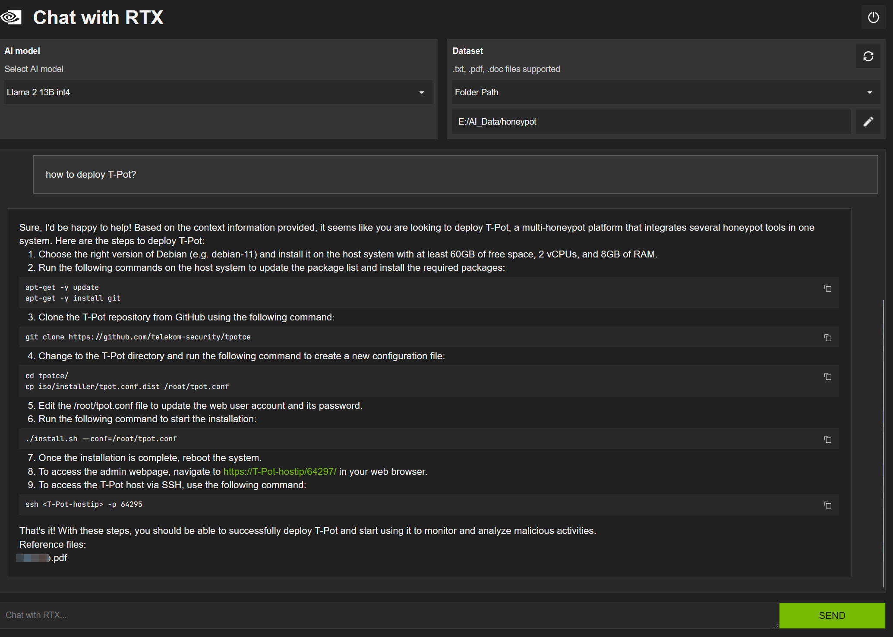
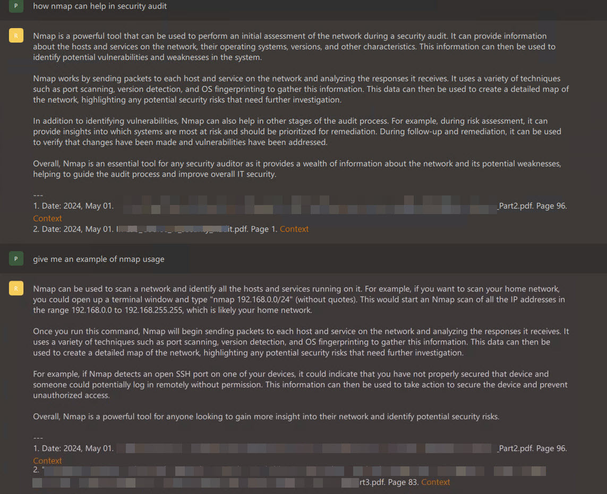

# LLM-Powered Knowledge Base for Enhanced Employee Job Handover, Backup, Training, and Research Project Archiving

## Project Overview
The objective of this project is to develop an advanced, AI-driven knowledge base leveraging a Large Language Model (LLM) that utilizes a vast repository of internal documents. This system aims to streamline employee job handovers, ensure effective job backups, enhance employee training, and archive research results from the [HoneyNet](https://github.com/alanshlam/HoneyNet) and [Pentest](https://github.com/alanshlam/Pentest) projects.

## Key Areas of Impact
### The developed LLM knowledge bases can help the following areas in an organization. 

### Employee Job Handover
- **Knowledge Transfer Efficiency**: The LLM knowledge base will facilitate seamless knowledge transfer during job handovers by providing detailed documentation and real-time answers to queries.
- **Consistency**: Ensure that critical information is consistently communicated during handovers, reducing the risk of errors and knowledge gaps.

### Job Backup
- **Operational Continuity**: Enable backup employees to quickly understand and take over responsibilities by accessing comprehensive information on tasks and projects through the LLM.
- **Task Guidance**: Provide step-by-step guidance and automate routine tasks to ensure smooth operation in the absence of primary employees.

### Employee Training
- **Customized Learning Paths**: Offer personalized training content and resources tailored to individual employee needs, enhancing learning effectiveness.
- **Resource Availability**: Aggregate and organize training materials, making it easy for employees to access and study relevant content.
- **Interactive Support**: Provide instant support and answers to training-related queries, fostering a continuous learning environment.

### Research Results Archiving
- **Knowledge Preservation**: Archive research results from the [HoneyNet](https://github.com/alanshlam/HoneyNet) and [Pentest](https://github.com/alanshlam/Pentest) projects to ensure valuable insights and findings are preserved and accessible for future reference.
- **Enhanced Research Capabilities**: Facilitate easy retrieval and analysis of past research, aiding in the development of new projects and the continuous improvement of cybersecurity measures.
- **Compliance and Accountability**: Ensure that research documentation meets compliance standards and provides a clear record of the organization's cybersecurity efforts and advancements.

## Expected Benefits
- **Improved Efficiency**: Reduce the time and effort required for job handovers and backups, leading to increased productivity, especially for an organization with high staffing turnover.
- **Enhanced Knowledge Retention**: Preserve institutional knowledge and ensure it is easily accessible to all employees.
- **Better Training Outcomes**: Equip employees with the knowledge and skills they need through personalized and interactive training methods.
- **Cost Savings**: Minimize the costs associated with training and onboarding new employees through streamlined processes and automated support.
- **Research Continuity**: Maintain a comprehensive archive of HoneyNet and Pentest research, supporting ongoing innovation and improved security measures.

## Project Scope
1. **Data Collection and Integration**
   - Gather and digitize all relevant internal documents, including project reports, standard operating procedures (SOPs), training manuals, and communication logs.
   - Integrate these documents into a centralized repository accessible by the LLM.
   - Archive research results from cybersecurity projects, ensuring they are well-documented and easily retrievable.

2. **LLM Training and Customization**
   - Train the LLM on the collected internal documents to ensure it understands the specific context, terminology, and processes of the organization.
   - Customize the LLM to address specific use cases such as job handovers, job backups, employee training, and cybersecurity research archiving.

3. **System Development**
   - Develop an intuitive user interface for employees to interact with the LLM.
   - Implement features for document search, task automation, interactive FAQs, and research result archiving.

4. **Testing and Validation**
   - Conduct rigorous testing to ensure the accuracy and reliability of the LLM's responses.
   - Validate the system through pilot programs involving key departments and refine based on feedback.

5. **Deployment and Training**
   - Roll out the LLM-powered knowledge base across the organization.
   - Provide training sessions to ensure employees are comfortable using the new system.

## Studies

### Evaluation of NLP Tools
ChatRTX, GPT4All, and LM Studio Natural Language Processing (NLP) tools were evaluated with different LLMs, including:
- Mistral 7B int4
- Llama 2 13B int4
- Llama 3 Instruct
- Nous Hermes 2 Mistral DPO
- Hermes
- Llama 3 - 8B Instruct
- Starling LM 7B Beta
- Hermes 2 Pro Mistral 7B
- OpenHermes 2.5 Mistral 7B

### Practical Applications
These tools can process a vast array of local documents and provide precise answers to specific inquiries:

- **Technical Team Weekly Meeting Minutes**: By processing over 20 years of technical team weekly meeting minutes, ChatRTX can provide accurate answers regarding recent FYP (Final Year Project) presentation support arrangements. This helps new staff members understand how to support FYP presentations without prior background information.
   
  
- **Technical Team Annual Reports**: By processing over 10 years of technical team annual reports, ChatRTX can provide accurate answers about recent courses supported by the technical team.
   
   
- **Network Switch Configuration Files**: By processing network switch configuration files, GPT4All can identify the correct network uplink interface and the interface connected to a particular VLAN.
   
   
- **Research Results**: By processing research results from HoneyNet and Pentest projects, ChatRTX and GPT4All can provide accurate answers and suggestions for honeypot deployment and tools used in penetration testing.
  
     The screenshot below shows how GPT4All replied the inquiry of deploying Honeypots on Cloud platform
     
     
     The screenshot below shows how ChatRTX replied the inquiry of deploying T-Pot
     

     The screenshot below shows how GPT4All replied the inquiry of how Nmap can help in security audit
     

      The screenshot below shows how ChatRTX suggested the honeypot for studying SSH break-ins
     

     
## Future Work
As we continue to develop and refine the LLM-powered knowledge base, several areas for future work and enhancement have been identified:

1. **Enhanced Natural Language Understanding**: Further improve the LLM's understanding of complex queries and nuanced language specific to the organization’s operations.
2. **Real-Time Data Integration**: Develop capabilities for the LLM to integrate and analyze real-time data, providing up-to-date insights and recommendations.
3. **Expanded Use Cases**: Explore additional use cases for the LLM beyond the initial scope, including end-user support, system upgrade, and strategic planning.
4. **User Feedback Loop**: Implement a robust feedback mechanism to continuously gather user input and refine the LLM's performance based on real-world usage.
5. **Multilingual Support**: Enhance the LLM to support multiple languages, facilitating knowledge transfer and training in a diverse, global workforce.
6. **Advanced Security Features**: Incorporate advanced security measures to protect sensitive data and ensure compliance with industry standards and regulations.
7. **Integration with Other Tools**: Seamlessly integrate the LLM with other enterprise tools and systems to create a unified knowledge management ecosystem.

