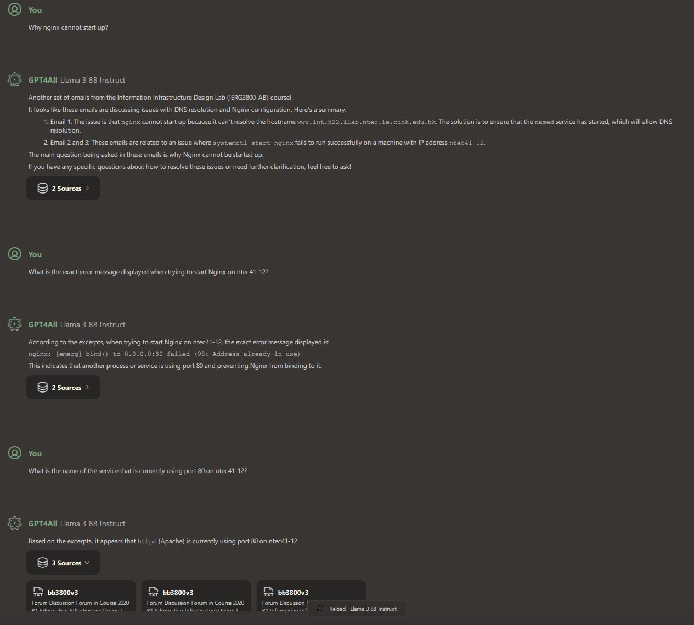

# LLM-Powered Knowledge Base for Enhanced Employee Job Handover, Backup, Training, and Research Project Archiving

## Project Overview
The objective of this project is to develop an advanced, AI-driven knowledge base leveraging a Large Language Model (LLM) that utilizes a vast repository of internal documents. This system aims to streamline employee job handovers, ensure effective job backups, enhance employee training, and archive research results from the [HoneyNet](https://github.com/alanshlam/HoneyNet) and [Pentest](https://github.com/alanshlam/Pentest) projects.

## Key Areas of Impact
### The developed LLM knowledge bases can help the following areas in an organization. 

### Employee Job Handover
- **Knowledge Transfer Efficiency**: The LLM knowledge base will facilitate seamless knowledge transfer during job handovers by providing detailed documentation and real-time answers to queries.
- **Consistency**: Ensure that critical information is consistently communicated during handovers, reducing the risk of errors and knowledge gaps.

### Job Backup
- **Operational Continuity**: Enable backup employees to quickly understand and take over responsibilities by accessing comprehensive information on tasks and projects through the LLM.
- **Task Guidance**: Provide step-by-step guidance and automate routine tasks to ensure smooth operation in the absence of primary employees.

### Employee Training
- **Customized Learning Paths**: Offer personalized training content and resources tailored to individual employee needs, enhancing learning effectiveness.
- **Resource Availability**: Aggregate and organize training materials, making it easy for employees to access and study relevant content.
- **Interactive Support**: Provide instant support and answers to training-related queries, fostering a continuous learning environment.

### Research Results Archiving
- **Knowledge Preservation**: Archive research results from the [HoneyNet](https://github.com/alanshlam/HoneyNet) and [Pentest](https://github.com/alanshlam/Pentest) projects to ensure valuable insights and findings are preserved and accessible for future reference.
- **Enhanced Research Capabilities**: Facilitate easy retrieval and analysis of past research, aiding in the development of new projects and the continuous improvement of cybersecurity measures.
- **Compliance and Accountability**: Ensure that research documentation meets compliance standards and provides a clear record of the organization's cybersecurity efforts and advancements.

## Expected Benefits
- **Improved Efficiency**: Reduce the time and effort required for job handovers and backups, leading to increased productivity, especially for an organization with high staffing turnover.
- **Enhanced Knowledge Retention**: Preserve institutional knowledge and ensure it is easily accessible to all employees.
- **Better Training Outcomes**: Equip employees with the knowledge and skills they need through personalized and interactive training methods.
- **Cost Savings**: Minimize the costs associated with training and onboarding new employees through streamlined processes and automated support.
- **Research Continuity**: Maintain a comprehensive archive of HoneyNet and Pentest research, supporting ongoing innovation and improved security measures.

## Project Scope
1. **Data Collection and Integration**
   - Gather and digitize all relevant internal documents, including project reports, standard operating procedures (SOPs), training manuals, and communication logs.
   - Integrate these documents into a centralized repository accessible by the LLM.
   - Archive research results from cybersecurity projects, ensuring they are well-documented and easily retrievable.

2. **LLM Training and Customization**
   - Train the LLM on the collected internal documents to ensure it understands the specific context, terminology, and processes of the organization.
   - Customize the LLM to address specific use cases such as job handovers, job backups, employee training, and cybersecurity research archiving.

3. **System Development**
   - Develop an intuitive user interface for employees to interact with the LLM.
   - Implement features for document search, task automation, interactive FAQs, and research result archiving.

4. **Testing and Validation**
   - Conduct rigorous testing to ensure the accuracy and reliability of the LLM's responses.
   - Validate the system through pilot programs involving key departments and refine based on feedback.

5. **Deployment and Training**
   - Roll out the LLM-powered knowledge base across the organization.
   - Provide training sessions to ensure employees are comfortable using the new system.

## Studies

### Evaluation of NLP Tools
ChatRTX, GPT4All, LM Studio, AnythingLLM, Ollma, Open WebUI, and Jan Natural Language Processing (NLP) tools were evaluated on various servers equipped with NVIDIA Tesla V100 and NVIDIA GeForce RTX 4090/3090/4070 GPUs using different LLMs, including:
- Llama 2, 3.1, 3.2, 3.3
- Deepseek-r1
- Deepseek Coder
- Mistral 
- Nous Hermes 2 Mistral DPO
- Hermes
- Starling LM 7B Beta
- Hermes 2 Pro Mistral 7B
- OpenHermes 2.5 Mistral 7B
  
### Practical Applications
These tools can process a vast array of local documents and provide precise answers to specific inquiries:

- **ChatBot Web UI**: A chatbot webpage built using a Streamlit UI Python application that connects to the Open-WebUI platform, helping students to solve their lab problems. The sample code is available for download [here](https://github.com/alanshlam/LLM/blob/main/code/chat_bot.py).
  

- **Comparing different LLM on Open-WebUI platform**: The Open-webUI platform can compare different LLM platform in parallel.
   
  
- **Open-WebUI with OLLAMA at the backend**: A model based on DeepSeek-r1 LLM with knowledge base data from over 3,200 posts in a lab course discussion forum helps students to debug their lab work in Open-WebUI platform.
  

- **Building a Knowledge base for a lab course FAQ**: By processing over 3,000 posts from a discussion forum in a lab course, GTP4ALL can provide the accurate answer to the Nginx start-up failure problem. This can be used to build up the knowledge base for the FAQ of this lab course.
   

- **Technical Team Weekly Meeting Minutes**: By processing over 20 years of technical team weekly meeting minutes, ChatRTX can provide accurate answers regarding recent FYP (Final Year Project) presentation support arrangements. This helps new staff members understand how to support FYP presentations without prior background information.
   
  
- **Technical Team Annual Reports**: By processing over 10 years of technical team annual reports, ChatRTX can provide accurate answers about recent courses supported by the technical team.
   
   
- **Network Switch Configuration Files**: By processing network switch configuration files, GPT4All can identify the correct network uplink interface and the interface connected to a particular VLAN.
   
   
- **Research Results**: By processing research results from [HoneyNet](https://github.com/alanshlam/HoneyNet) and [Pentest](https://github.com/alanshlam/Pentest) projects, ChatRTX and GPT4All can provide accurate answers and suggestions for honeypot deployment and tools used in penetration testing.
  
     The screenshot below shows how GPT4All replied the inquiry of deploying Honeypots on Cloud platform
     
     
     The screenshot below shows how GPT4All replied the inquiry of how Nmap can help in security audit
     

     The screenshot below shows how ChatRTX suggested which honeypots for studying SSH break-ins
     
  
## Future Work
As we continue to develop and refine the LLM-powered knowledge base, several areas for future work and enhancement have been identified:

1. **Enhanced Natural Language Processing (NLP) Tool Exploration**: Conduct thorough research and evaluation of additional NLP tools to augment the existing capabilities of the LLM knowledge base. Integrate these tools with various LLMs to enhance the accuracy and efficiency of queries, resulting in more precise and comprehensive information retrieval.
2. **Document Restructuring and Standardization**: Revamp the internal document format and templates to optimize the learning and comprehension process for the LLM knowledge base. Implement standardized structures and guidelines that facilitate seamless interaction between the LLM and documents, ensuring efficient knowledge extraction and representation.
3. **Enhanced Natural Language Understanding**: Continuously enhance the LLM's ability to understand complex queries and nuanced language specific to the organization's operations. Invest in training and fine-tuning the LLM to accurately interpret the intricacies of domain-specific terminology and context, enabling more accurate and contextually appropriate responses.
4. **Real-Time Data Integration**: Develop capabilities for the LLM to integrate and analyze real-time data streams. This integration will enable the LLM to provide up-to-date insights and recommendations, empowering users with real-time information for decision-making and improved situational awareness.
5. **Expanded Use Cases**: Explore additional applications and use cases for the LLM beyond the initial scope. Consider leveraging the LLM for end-user support, system upgrades, and strategic planning, among other areas. By expanding the utility of the LLM, its value and impact within the organization will be maximized.
6. **User Feedback Loop**: Establish a robust feedback mechanism to gather continuous user input and insights. Actively incorporate user feedback into the development cycle, refining the LLM's performance and addressing any shortcomings. This iterative process will ensure the ongoing improvement and optimization of the LLM based on real-world usage scenarios.
7. **Multilingual Support**:  Enhance the LLM to support multiple languages, catering to a diverse and global workforce. Enable seamless knowledge transfer and training across different languages, promoting effective communication and collaboration within the organization, regardless of linguistic diversity.
8. **Advanced Security Features**:Implement advanced security measures to safeguard sensitive data and ensure compliance with industry standards and regulations. Employ encryption, access controls, and other security protocols to protect the confidentiality and integrity of information processed by the LLM.
9. **Integration with Other Tools**: Seamlessly integrate the LLM with other enterprise tools and systems to create a unified knowledge management ecosystem. Establish APIs and data connectors to enable smooth data exchange and interoperability, enabling users to leverage the LLM's capabilities in conjunction with other critical tools and platforms.

By focusing on these future initiatives, we aim to harness the full potential of the LLM, making it a valuable asset for knowledge management, decision support, and operational efficiency within the organization.

