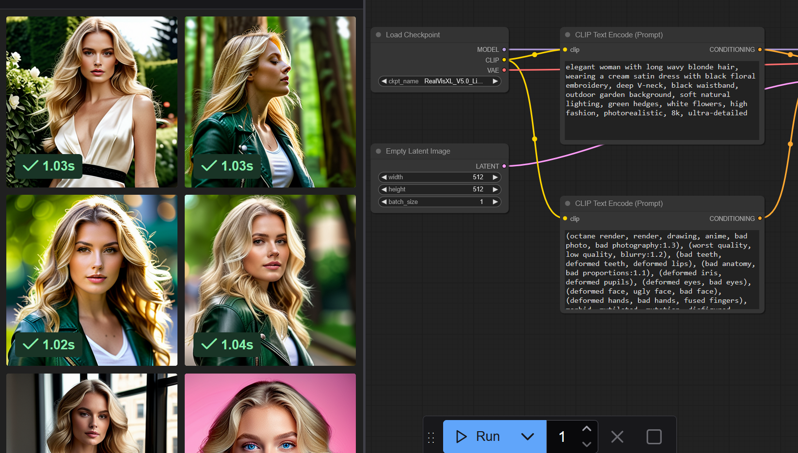

This folder archives the code for text to image or image to image generation powered by LLM and ComfyUI, and some regenerated image samples.

### index.html: index file for the web application
### server.py:  python code for analyzing and generating the images
### llm-img.conf: nginx config for the web application

To run the code:
uvicorn server:app --host 127.0.0.1 --port 9000 --log-level debug

### image_regenerated_in_ComfyUI.png :  Regenerated images in ConfyUI

### regenerated_image_sample (*).png :  Regenerated image samples

