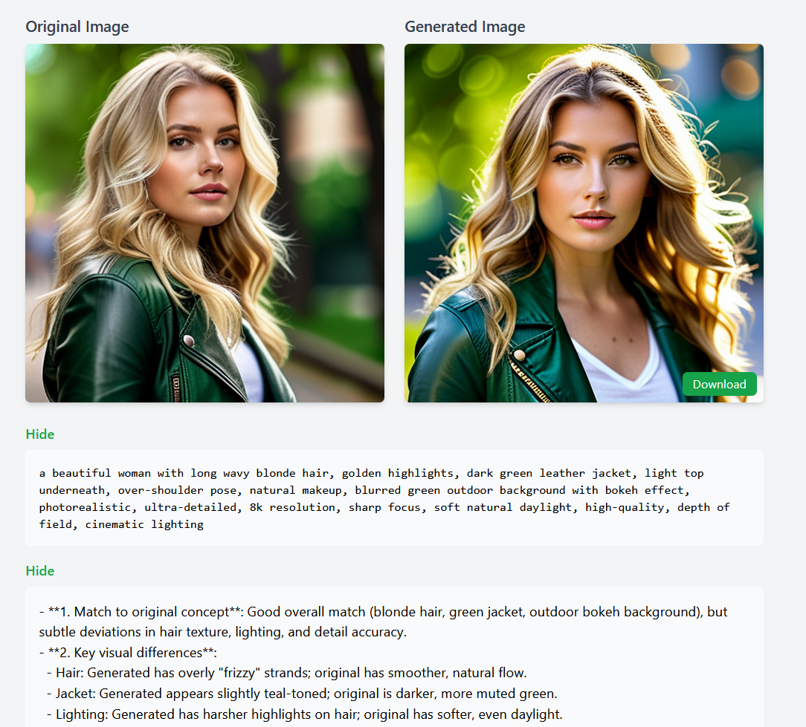
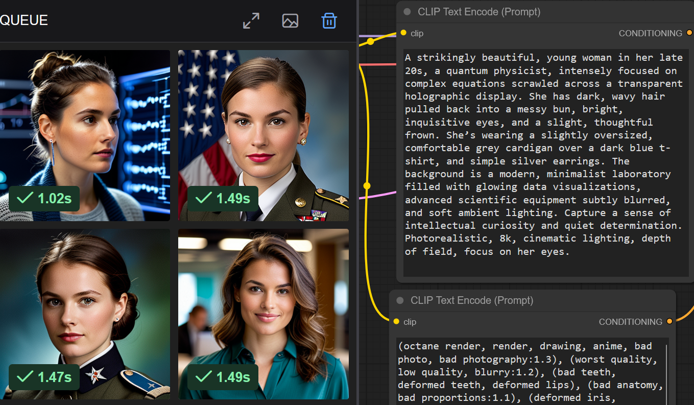

# AI Image Generation

This repository explores the exciting world of AI-powered image generation! With advancements in machine learning, it's now possible to create stunning visuals from text prompts, transform existing images, or achieve specific artistic styles.

## Overview

Image generation is rapidly evolving, driven by powerful models like Stable Diffusion, Midjourney, and DALL-E.  These models learn from vast datasets of images and text, allowing them to synthesize new images based on user input.  This project showcases techniques and resources for leveraging these models.

## Supported Models & Platforms

Image generation can be accomplished using various AI models and platforms. Here's a breakdown of some popular options:

* **Stable Diffusion:**  A powerful open-source text-to-image model known for its flexibility and customizability.
* **Midjourney:** A popular AI art generator accessible via Discord, known for its aesthetically pleasing results.
* **DALL-E:** An AI system from OpenAI that creates realistic images and art from a description in natural language.
---
### 🧠 LLM Image Prompt Analyzer and Regenerator for ComfyUI

This project extends my previous web application that studies how Large Language Models (LLMs) generate image prompts from text. In this new version, you can **upload an image**, let a **vision-capable LLM** analyze it, generate a **descriptive image prompt**, and then **regenerate a similar image** using **ComfyUI**.

#### 🚀 Features

- 🖼️ **Upload any image** for analysis  
- 🤖 **Vision LLM integration** — automatically generates a detailed image prompt  
- 🎨 **ComfyUI regeneration** — creates a new image based on the LLM’s prompt  
- 🔍 **Side-by-side comparison** of the original and regenerated images  
- 🧩 **Interactive study tool** to explore how LLMs interpret and recreate visual content  

#### 🎯 Purpose

This tool is designed for:
- AI researchers and developers exploring **multimodal LLMs**
- **Prompt engineers** studying how AI perceives and describes images
- Enthusiasts who want to understand how **AI vision** and **ComfyUI** work together  

It helps you visualize the connection between **visual understanding** and **text-to-image generation**.
#### ⚠️ Disclaimer

This project is created **for research and educational purposes** —  
to study how **vision-capable Large Language Models (LLMs)** analyze images and generate descriptive prompts.

It is **not designed for image editing, morphing, or enhancement**.  
There are many specialized tools and models that focus on artistic or style-based image transformation.  
Instead, this project focuses on **understanding AI perception** —  
how LLMs interpret visual content and translate it into textual prompts that can regenerate similar images in **ComfyUI**.

#### 📺 Demo Video

🎥 **Watch the full demo on my YouTube Channel:**  
👉  

In the video, you’ll see how the web app:
1. Analyzes an uploaded image using a vision LLM  
2. Suggests a descriptive image prompt  
3. Uses the prompt to regenerate a similar image in ComfyUI  
4. Displays both images for comparison  

#### 📦 Source code and regenerated image samples on GitHub:
You can download the source code,htlm file,and nginx config file of this web application and view some regenerated images samples at 
[https://github.com/alanshlam/LLM/tree/main/code/txt_img2img](https://github.com/alanshlam/LLM/tree/main/code/txt_img2img)

#### 🧰 Technologies Used

- Python / FastAPI (for backend)  
- Vision-capable LLM (e.g., llama3.2-vision:11b,llama3.2-vision:90b,qwen3-vl:32b model)  
- ComfyUI (for image regeneration)  
- HTML / JS frontend  

#### 🏗️ Future Improvements

- Add support for multiple LLMs for prompt comparison  
- Provide visual explanations (bounding boxes or captions)  
- Integrate prompt refinement controls  
- Enable batch image analysis  

#### 🔖 License

This project is released under the **MIT License** — feel free to explore, modify, and improve it.  

---
## 🧠 LLM Image Prompt Analysis Tool for ComfyUI

This project demonstrates how **Large Language Models (LLMs)** generate **image prompts** for **ComfyUI** image generation.  
Through this application, you can **study, compare, and analyze** how different LLMs produce image prompts and how those prompts influence the final AI-generated images.

### 🚀 Features

- 🧩 Study and compare image prompts from multiple LLMs  
- 🖼️ Review detailed image metadata generated by ComfyUI  
- 🔍 Understand how prompt wording impacts the final image  
- 💾 Open-source and easy to extend for your own experiments  

### 🎓 Purpose

This application is built **purely for educational and research purposes** — to help developers, researchers, and AI enthusiasts better understand the **prompt generation behavior of LLMs** and the **image synthesis process** in ComfyUI.

It is **not intended** for image morphing, editing, or manipulation — many specialized tools already exist for that.  
Instead, this project focuses on **AI prompt analysis and understanding**.

### 🧰 Getting Started

1. Get the code, html file and nginx config file from
   [https://github.com/alanshlam/LLM/tree/main/code/txt_img2img](https://github.com/alanshlam/LLM/tree/main/code/txt_img2img)
2. Start the web application by uvicorn server:app --host 127.0.0.1 --port 9000 --log-level debug

### 🎥 **Watch its  full demo on my YouTube:**  
👉  

---

## Achieving Specific Styles: Ghibli Inspiration

This project provides resources for generating images in the iconic style of Studio Ghibli!  Here's how:

* **FLUX.1-dev (black-forest-labs/FLUX.1-dev):**  A powerful model focusing on image generation and transformation.
* **flux-chatgpt-ghibli-lora (openfree/flux-chatgpt-ghibli-lora) & flux-chatgpt-ghibli-lora.safetensors:**  A LoRA (Low-Rank Adaptation) specifically trained to infuse images with the Ghibli aesthetic.  LoRAs are smaller models that can be applied on top of a base model to achieve a specific style.

Below is an example demonstrating how to generate or transform images in the Ghibli style with the above resources:  
 Compare the original image and transformed image 
 

You can download below Ghibli Web UI program [here](../code/app_3090.py) 
 

---
## ComfyUI Integration

For advanced control and workflow customization, consider using [ComfyUI](https://github.com/comfyanonymous/ComfyUI).  ComfyUI is a modular interface for Stable Diffusion, allowing you to chain together various image processing nodes to create complex workflows. Numerous image models and workflows are available within the ComfyUI ecosystem.

Below is an example of using ComfyUI with the Gemma 3.27B LLM and RealVisXL V5.0 to generate an image and follow up on its generation using Open WebUI: 

---
## Prompt Engineering & LLM Assistance

Crafting effective prompts is crucial for generating desired results.  Large Language Models (LLMs) can be incredibly helpful in refining your prompts, suggesting keywords, and improving overall coherence.  Consider using an LLM to:

* **Expand on a basic prompt:**  "A cat sitting on a wall" ->  "A fluffy ginger cat sits contentedly on a weathered stone wall, bathed in the golden light of a late afternoon sunset, with wildflowers growing nearby."
* **Add artistic details:**  "Generate a portrait in the style of Van Gogh."
* **Optimize for specific models:**  Adjust prompts to suit the strengths of different AI models.

Below is an example of how to use LLM to generate prompt for image generation.You can download below Web UI program [here](../code/img_prompt_server.py) 

We encourage you to explore the resources and techniques provided here to unlock the full potential of AI-powered image generation!
