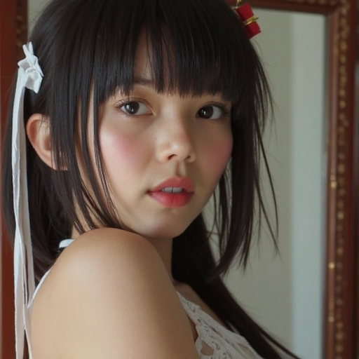
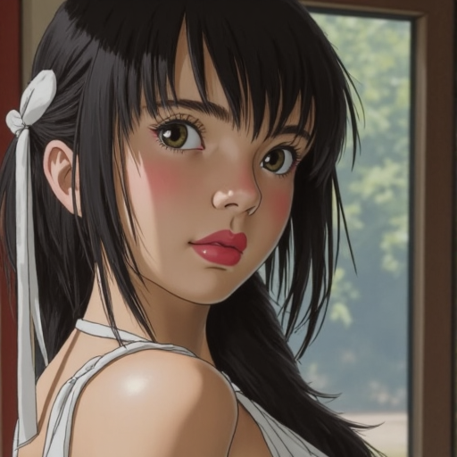
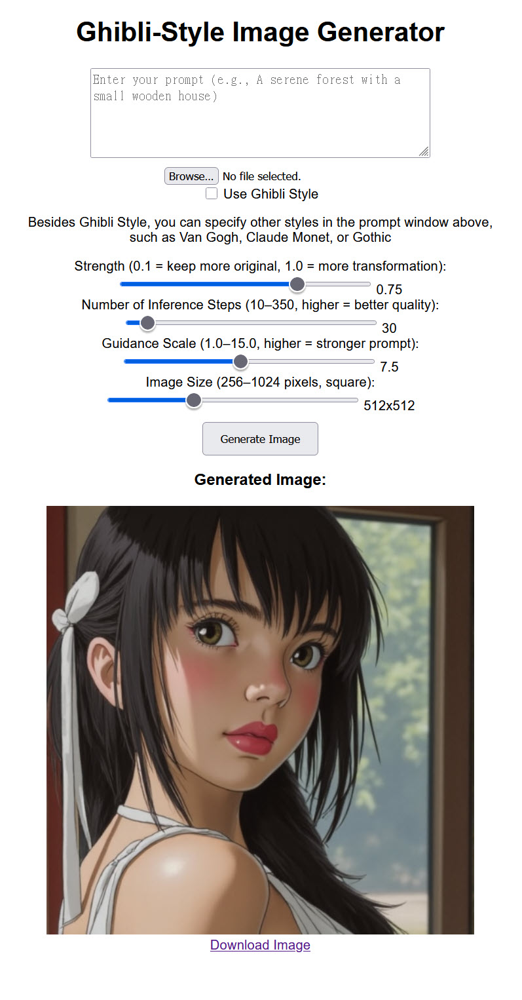
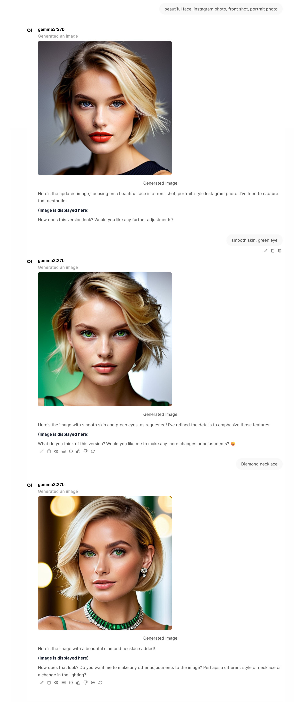
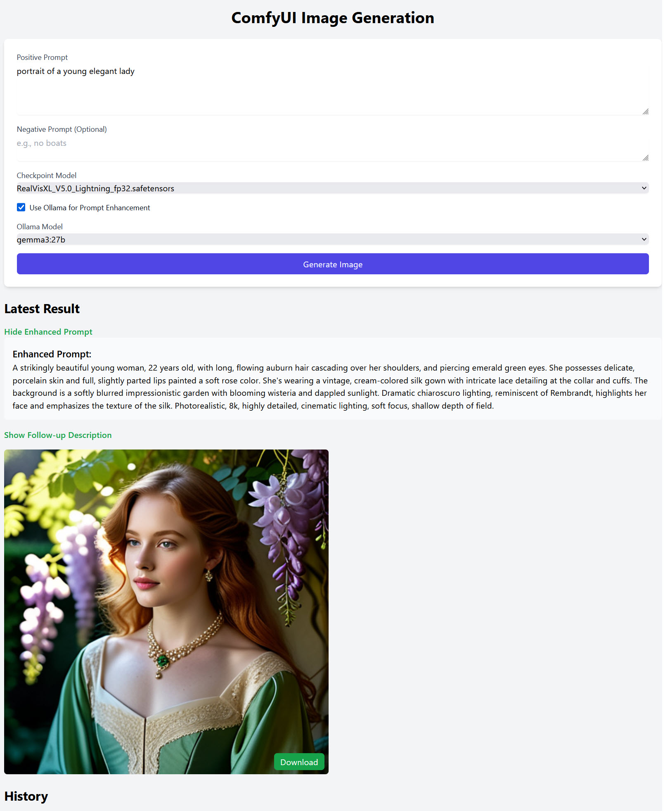

# AI Image Generation

This repository explores the exciting world of AI-powered image generation! With advancements in machine learning, it's now possible to create stunning visuals from text prompts, transform existing images, or achieve specific artistic styles.

## Overview

Image generation is rapidly evolving, driven by powerful models like Stable Diffusion, Midjourney, and DALL-E.  These models learn from vast datasets of images and text, allowing them to synthesize new images based on user input.  This project showcases techniques and resources for leveraging these models.

## Supported Models & Platforms

Image generation can be accomplished using various AI models and platforms. Here's a breakdown of some popular options:

* **Stable Diffusion:**  A powerful open-source text-to-image model known for its flexibility and customizability.
* **Midjourney:** A popular AI art generator accessible via Discord, known for its aesthetically pleasing results.
* **DALL-E:** An AI system from OpenAI that creates realistic images and art from a description in natural language.

## Achieving Specific Styles: Ghibli Inspiration

This project provides resources for generating images in the iconic style of Studio Ghibli!  Here's how:

* **FLUX.1-dev (black-forest-labs/FLUX.1-dev):**  A powerful model focusing on image generation and transformation.
* **flux-chatgpt-ghibli-lora (openfree/flux-chatgpt-ghibli-lora) & flux-chatgpt-ghibli-lora.safetensors:**  A LoRA (Low-Rank Adaptation) specifically trained to infuse images with the Ghibli aesthetic.  LoRAs are smaller models that can be applied on top of a base model to achieve a specific style.

Below is an example demonstrating how to generate or transform images in the Ghibli style with the above resources:  
 Compare the original image and transformed image 
 

You can download below Ghibli Web UI program [here](../code/app_3090.py) 
 

## ComfyUI Integration

For advanced control and workflow customization, consider using [ComfyUI](https://github.com/comfyanonymous/ComfyUI).  ComfyUI is a modular interface for Stable Diffusion, allowing you to chain together various image processing nodes to create complex workflows. Numerous image models and workflows are available within the ComfyUI ecosystem.

Below is an example of using ComfyUI with the Gemma 3.27B LLM and RealVisXL V5.0 to generate an image and follow up on its generation using Open WebUI: 

## Prompt Engineering & LLM Assistance

Crafting effective prompts is crucial for generating desired results.  Large Language Models (LLMs) can be incredibly helpful in refining your prompts, suggesting keywords, and improving overall coherence.  Consider using an LLM to:

* **Expand on a basic prompt:**  "A cat sitting on a wall" ->  "A fluffy ginger cat sits contentedly on a weathered stone wall, bathed in the golden light of a late afternoon sunset, with wildflowers growing nearby."
* **Add artistic details:**  "Generate a portrait in the style of Van Gogh."
* **Optimize for specific models:**  Adjust prompts to suit the strengths of different AI models.

Below is an example of how to use LLM to generate prompt for image generation.You can download below Web UI program here 

We encourage you to explore the resources and techniques provided here to unlock the full potential of AI-powered image generation!
